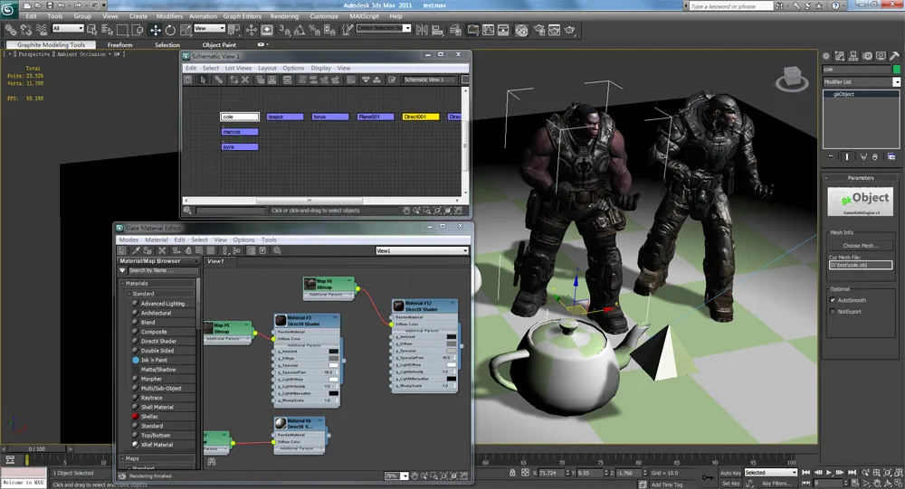

## GameKnifeEngine 地编雏形

目前的地编雏形。3dsMax + gkObject插件v1

透过gkObject面板的“Choose Mesh”可以改变当前物体所挂载的mesh文件

而场景导出时，每个gkObject只导出挂载的maxNode信息，mesh和material，其实也就对应了GameKnifeEngine中的Node和Renderable。

不得不说，max2011越来越像个引擎了...节点材质系统，schematic view，加上我自己写的gkObject。是不是有点UDK的味道呢~

# 缘起

GameKnifeEngine基础基本上写完了，现在需要导入一些比较丰富的场景进行测试，正好20多天以后又要面临毕设检查了，因此现在急需一个地图编辑器。

上周和文放师哥聊了好久，他提出了应该砍掉一些冗余的设定，比如我对submesh的设想。并且还是建议我尽量简单化这个导出步骤。确实，如果过多的复杂设计可能会花大量的时间。然而实际上对游戏没有多大的帮助，最多也就是省下点分开导出场景物体的麻烦。而在对接和设计方面也许会多花很多很多的时间。

不过，我还是决定要使用MAX来做地编，原因嘛：

1. max的视点操作，材质系统，场景管理方面做得相当成熟，并且max的节点系统和gkEngine的scenegraph结构也可以实现完整对接。这些东西如果要自己来做，第一是相当耗费时间，而且肯定会比max差很远。

2. 目前游戏引擎都是 客户端+地编+max导出插件的形式。再依样画葫芦一个意义不大。而且地编工具这一块也不是一个人能够完成得很好的，软件设计.. ui这边太难做了... 倒不如另辟蹊径，开发一个更贴近美工的MAX内的地编。这样模型直接可以在地编内建立，导出插件也省了，直接导出场景完事。最后，要保存地图文件直接保存MAX文件即可，相当之省事。

3. 本人对3dsmax太有感情了，之前的框架就用土办法实现了max地编基本功能，还是想继续用max啊~

4. 如果完成了设想的整合lua到max中，控制一些物体的运动行为。如果再作一节点查找，是否可以直接在max驱动游戏了？如果这样，是否也算是一个创举？用max驱动的3d游戏貌似还没见过，之前见过用maxscript写的TERIS...

# 设计

其实要做这个max地编，经过这几天的分析，事情不太多。

### 1. gkObject结构

该结构属于max的一个object，可以在create面板创建出来，并且在modify面板进行修改。此结构是游戏实体在地编中的体现。目前设计属性是：mesh属性（mesh文件名，供游戏中寻找相应的mesh资源构建），material属性（shader文件+参数块，max中由自带的material系统体现），/* behavior属性（lua脚本，用于控制物体的一些简单行为，例如自旋转，位移等，用于实现一些场景中的动态效果） */。

### 2. gkSceneExporter结构

这个结构负责将整个max场景导出成游戏程序可以解析的地图文件（.gkScene）。结构负责读取gkObject中的各种属性，按照顺序写入场景文件中。

### 3. gkSceneImporter结构

这个结构位于游戏中，负责将地图文件解析出来，并通知gkSceneManager构建地图文件描述的场景，使得和max中的表现趋于一致。

# 实现

星期六一天，整合了上周摸索的一些东西，做出了一个比较简单的gkObject，实现了由modify面板中选择相应的mesh文件，场景中自动重新buildmesh的一个机制。这样就可以保证导出的时候正确的导出mesh资源索引名。mesh资源不发生冗余。material属性在gkObject上基本只是一个显示的功能，实际的事情以后做在Exporter上面。lua脚本那部分，还只算一个设想，要根据项目剩余时间情况考虑是否加上。

Exporter考虑把上一次的场景导出工具拿过来改改，直接用了。正好可以配合以前研究了一周的tinyxml解析工具制作游戏内的Importer。

这个是这个星期的一些思考和小部分实现，还不太完全。下周过了有了整块的时间之后，再实现一些功能会上来和大家继续分享。呵呵，拭目以待吧~
