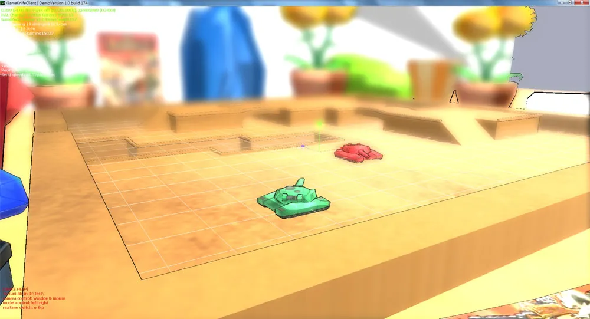
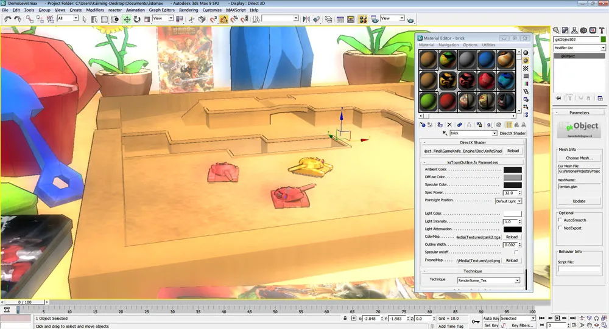
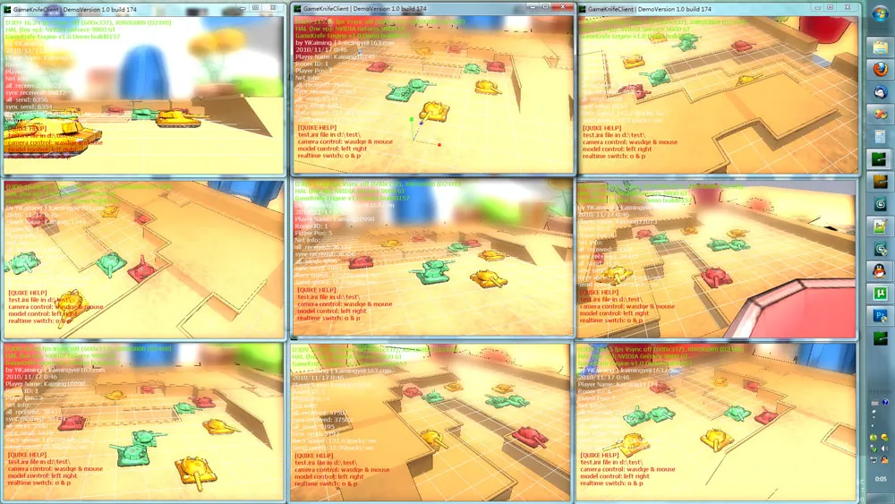

## 毕设中期检查前一天

终于完成了！

自从上个星期一从公司离职，回家闭关写了整整一个星期... 中间平安夜圣诞节也就和女友象征性的过了一下。终于，在毕设中期检查的前一天完成了！

*toonshading + 复杂后处理 + 1920*1080... pixelshader表示压力很大...*

*等检查完了开始优化...检查嘛，主要是用画面感觉震住老师们...*

## 这一个星期的成果

其实11月中旬那次检查，GameKnifeEngine的底层就已经出来了。模仿OGRE的几个核心：[gkSceneManager] [gkResourceManagers] [gkRenderSequence] 已经联系在一起了。

由于时间紧迫gkRenderTarget只是个[虚拟]的假象， 模型渲染直接继承了Renderable和Movable做了一个最基本的物体。这次的一个半月，主要是做一些和TANK3D游戏开发本身相关的一些东西。

### gkGameObject

提供对游戏物件的抽象，这个抽象同时存在于GameKnifeEngine中和Max场景编辑器中。其上可以挂载一系列SubMesh用于渲染，每个可以设置不同Material；可以挂载一个luaScript，来控制一些简单运动；可以挂载一个physxemulator，来实现物理模拟或碰撞检测。

### max场景编辑器

毕业设计的开发时间共计7个月，目前已经花了3个半月开发底层了。还有3个半月做游戏逻辑和改进，优化，最后测试。而场景编辑器对我们这个游戏来说应该是必不可少的，但是如果要基于游戏引擎，开发一个只上的场景编辑器，开销太大：UI界面系统，交互系统，特殊渲染，可能还得开发插件系统... 反正各种复杂，估计3个半月拿来开发都不够...

而我“从小”就对3dsmax有很深厚的感情，3dsmax的交互跟（silo，modo比起来）虽然算不上非常人性化，但是比起我使用过的游戏引擎编辑器来说，应该是最好的了。max本身有相当强大的插件系统，并且内部的管理也十分庞大，几乎所有问题都能够得到相应的解决方法，何不使用max作为场景编辑器呢？

其实，我只写了两个插件，就初步构建出了场景编辑器结构。

1：gkObject，这是之前说的那个抽象。在这里可以直接选择资源库中的gkm模型文件加载，使用max的directx材质球来编辑材质，挂载luaScript来控制简单逻辑。

2：gkSceneExporter，这里从max场景中遍历node，如果是gkObject就将其模型文件，shader文件，材质参数块，脚本文件和其变换信息和节点结构写入xml。最后GameKnifeEngine通过xml解析器来将max中编辑好的场景还原。

*max中编辑的场景，一键导出gks文件，gameknifeengine就可以建立出一个完全一样的场景，并且可以通过max中的object名称取得每个物体的控制权*

当然，要制作成一个完整的地形编辑器，还差得比较远。之后的三个半月，需要完善luaScript对max中node的控制，使得能在max中看到脚本的效果。

### PostProcess处理器

后处理，自从知道了这种技术后就一直很热衷。可能也是因为photoshop经常修图的原因吧，其实后处理感觉就是用shader的photoshop，两个RTchain来回处理，两层通过蒙版叠加...通过对渲染出来的最终图像进行图层级别的处理和混合，达到PS级别的效果。确实是一个非常美妙的事情。fakeHDR，DepthOfField，NormalDetectedToonShading，这些技术真是太棒了！

这次的后处理基本是参照directx的sample做的，不过将setRenderTarget的方式改为了截获surface，和我的gkRenderTarget系统联系了起来。另外增加了CopyToSrc的操作，因为在处理途中可能需要暂存一些处理后的图像但不立即用在下一次处理，所以要拷贝到一个缓存中在之后应当操作的时候再取出来操作。（其实这一节做得很仓促，思考和实现时间都非常短...）

后处理的原理这里稍微说一下吧：

第一步：将场景渲染到color，normal，position通道。这里的color就是意指通常的渲染结果，normal是基于view坐标系的每个点的normal值，在很多后处理中有大用处，例如卡通勾边等，position是基于view坐标系每个点的位置，在后处理中也有很大用处，例如景深效果，运动模糊等。渲染的方式目前的新显卡直接使用simulateRT就行了，直接在PS阶段输出到COLOR0, COLOR1, COLOR2。只用走一个pass就行了，否则，就要走多次pass进行不必要的VS阶段。

第二步：根据预先设置的后处理shader顺序，使用刚才得到的三个通道图像作为贴图传入，进行计算，最后存到RTchain中。Rtchain有点swapBuffer的味道，其上有两个surface，一次操作时以A作为源，写入到B。然后翻转，下一次操作，以B作为源，写入到A，再次翻转... 这样理论上可以实现无限多次的后处理（前提要你的机器够快...）

第三步：后处理将所有顺序进行完成以后，用当前激活的RTCHAIN的SURFACE写到BACKBUFFER上，在屏幕上渲染出最终图像。

## 服务器-客户端结构

这次毕设的进展还包括网络结构的搭建。目前服务器，客户端底层已经搭建完成，基本消息结构也建立完毕。

*本机9客户端大战，服务器的并发效率还是很高的~*

网络这里其他就不大多说了，其实自己还是比较水。服务器是找了个IOCP的服务器结构，给每个socket线程写了点小逻辑，然后加入了自己的消息结构。关于消息结构大家可以看一下game gem3 的 serializer（序列化）。特别好用！

网络这边感觉唯一值得一提的就是变换信息的同步。一开始，我是通过发送position，orientation，velocity来实现网络玩家的同步的。但发现效果很不理想，因为发包和收包的时机是完全不同的，所以这边老是卡一卡的忽快忽慢。后来通过查资料等各种方式，了解到有一个timestamp（时间戳）这个概念。也就是说，我在信息里加一条我发送的时间，即使你接到包的间隔和我发送不一样，你也可以将它“变”得一样。这里就要根据时间戳插值了。

举个例子：

我客户端A发送了a,b,c,d四个包。客户端B收到了这a,b,c,d四个包。那么，我应该用哪一个呢？

不怕，我们有时间戳，时间同步的问题这里就不多说了，虽然两个客户端系统时钟可能不同，但是假设时间流逝是一样的（用加速齿轮除外）...这个好理解。

那么，我们就根据现在的时间，找到我现在应该要的时间戳time，然后在我收到的a,b,c,d的四个包中找到time前后的两个包，假设是b，c。那么这时，我们就可以根据b，c的时间戳和time比较，来做一个从b到c的插值，得到一个位于b，c“中间的包”。

利用它作为当前帧的信息，就不会出现“卡”的现象了。
