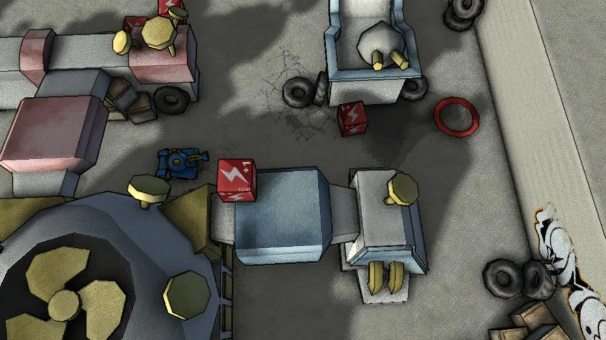
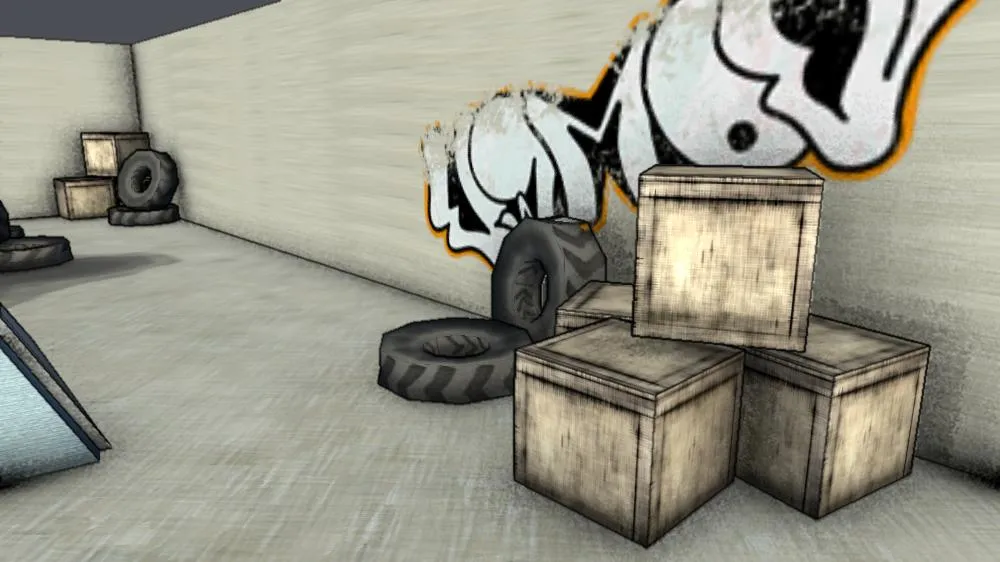
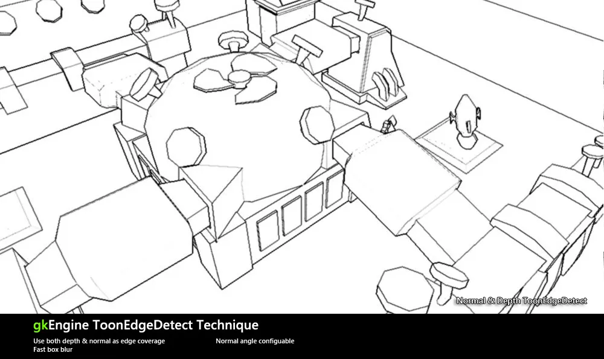
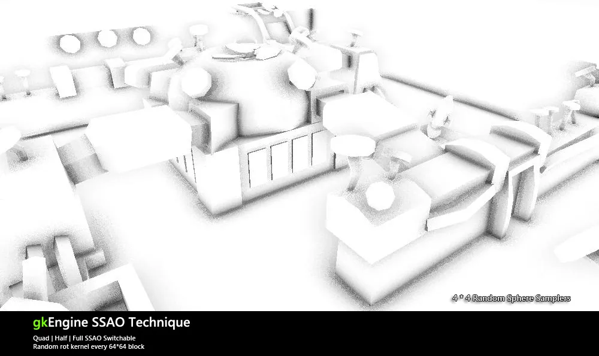
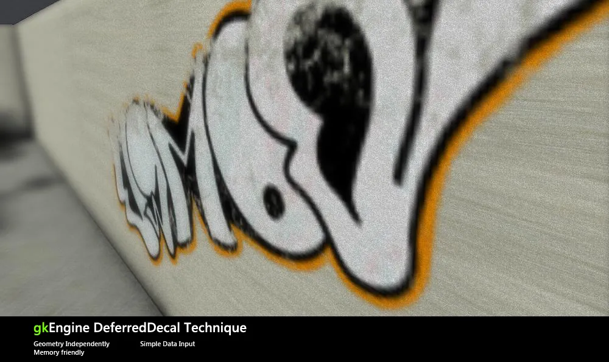
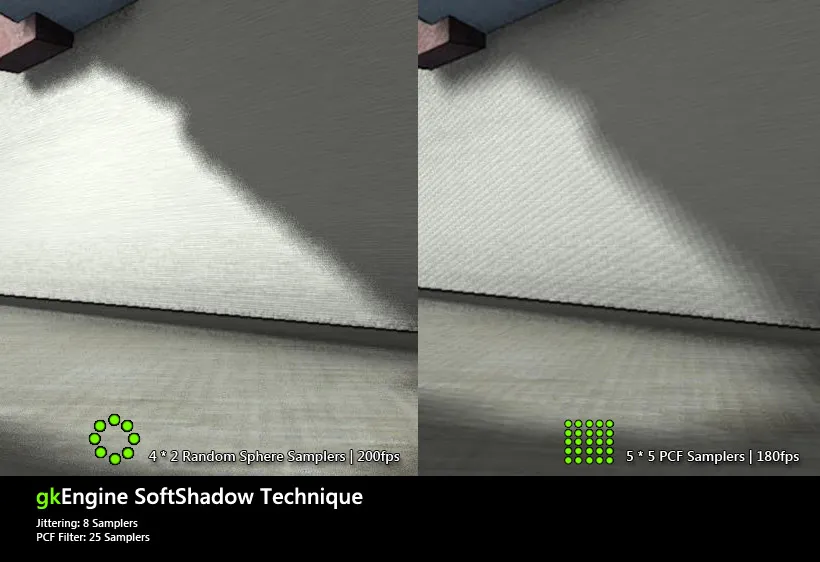
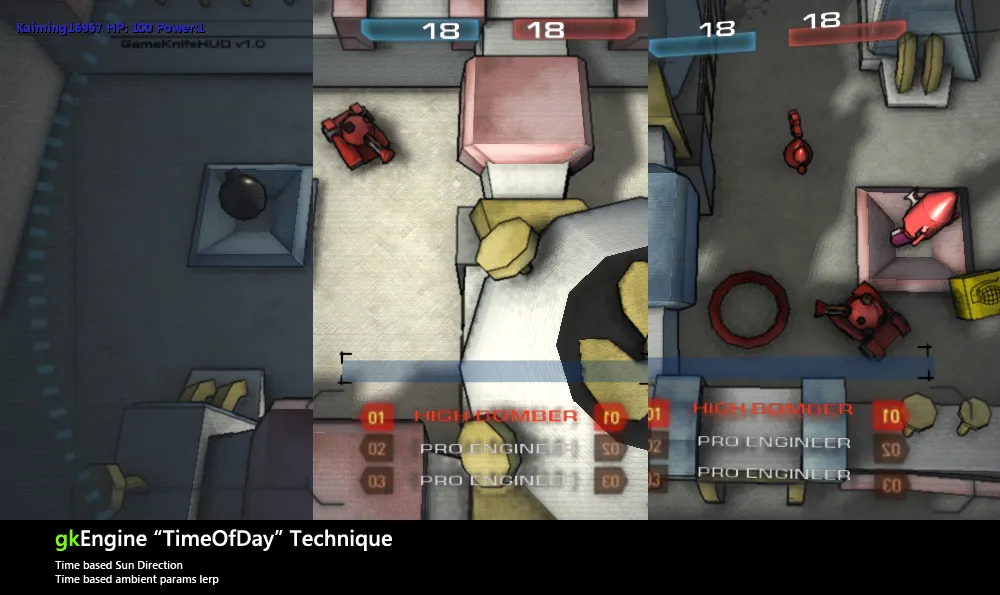
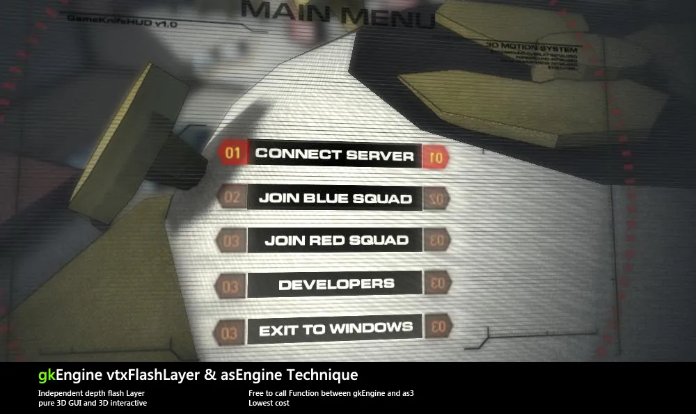
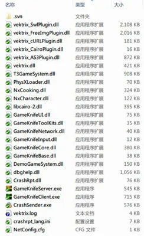
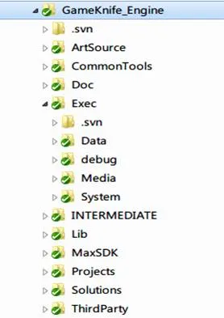

# 小序

毕业设计终于接近尾声了，一个周末都没有继续写代码，正好有一个经验分享，所以把PPT的总结报告转写成一篇blog，希望得到高手们的指点。同时也希望能给还在读书的师弟师妹们一些建议和启发吧。同时，也是对自己这半年来成长的一个总结和记录。希望以后能够在工作岗位上继续努力，继续进步！

目前先转写前两部分的内容，图比较多而且直观，明后天再继续转写重头戏： 开发流程

最后，部分有价值的图形技术考虑分别写博来总结一下，主要是对技术的一个总结吧，还有也是希望对还在读书的师弟师妹们一些启发。

## 本文目录

图形特性

模块划分和文件夹结构

开发过程

用到的一些开源库介绍

# 图形特性

图形特性上，本打算做真实感渲染的，可惜资源制作能力太缺乏了，所以最后还是选择了 NPR非真实感渲染。

不过在图形技术上还是使用了Shadowmap，SSAO，DOF，延迟渲染等现代真实感渲染技术，锻炼了自己的图形开发能力，同时也算是将这些特性很好的和NPR结合在了一起。以下会对每个图形技术配图并附上简单的说明，具体实现可能在以后会抽时间一个一个的记录在博客园上（毕竟毕设完成以后，业余时间就空闲出来了~ 闲下来的时候写写技术实现同时巩固巩固技术~）

## 淡彩手绘效果

下面是几张目前的游戏截图：

游戏视点1： 180fps @ Nv 9800GT | 1000 x 563 pixels

特写1

## 深度+法线通道的卡通边缘检测

同时使用深度和法线通道信息来计算边缘贡献，得到高质量的描边结果。这是我们决定的NPR效果中最重要的一个功能。

## SSAO

提供了downscale，默认是使用halfSSAO，来提升性能。采样方式采用随机球面采样，来取得噪点和平滑的遮蔽阴影。

## 后处理贴花

后处理贴花是制作后期的美术需求。在场景中投射一定数量的贴图，来丰富场景表现。后处理贴花的优势在于不消耗DP，与场景复杂度无关。

## 软阴影处理

同时实现了PCF和Jittering方式的阴影软化，Jittering方式是目前最流行的高性价比阴影软化方案

## TimeOfDay

以设置时间来改变太阳光的角度，阴影浓度，环境光颜色，实现简单的昼夜效果

## swf 3DGUI

实现了flash制作GUI层，在游戏中3D呈现出来并提供交互功能，交互代码可以直接编写在as3脚本中，与cpp互调函数通信。

# 模块划分与文件夹结构

这里粗略的分析一下目前游戏的模块划分和文件夹结构，具体的细节和设计思路以后可能也会单写blog总结。

模块的划分总体说来有点过度设计的味道哦，目前发布版可执行文件夹的结构如下：

Vektrix库及所需插件

游戏系统模块

GameSystem模块，游戏系统

gkBase模块，客户端服务器的公用信息模型

gkEngine内核模块

vtxUI模块

gk工具模块，通用工具集

gk网络模块，基础通信结构

gk输入模块，键盘鼠标手柄控制

gk核心模块，核心渲染模块

服务器和客户端exe

其他库：Physx物理库，CrashRpt库，cairo图像处理库

下面是目前的开发文件夹结构：

Exec:发布文件夹

游戏数据（地图，关卡）

Debug程序

资源文件（材质，模型，贴图，swf）

Release程序

INTERMEDIATE:中间文件夹

Lib:库文件夹

maxSDK文件夹

Project:工程源码文件夹

Solution:解决方案

ThirdParty:第三方工程

待续！
