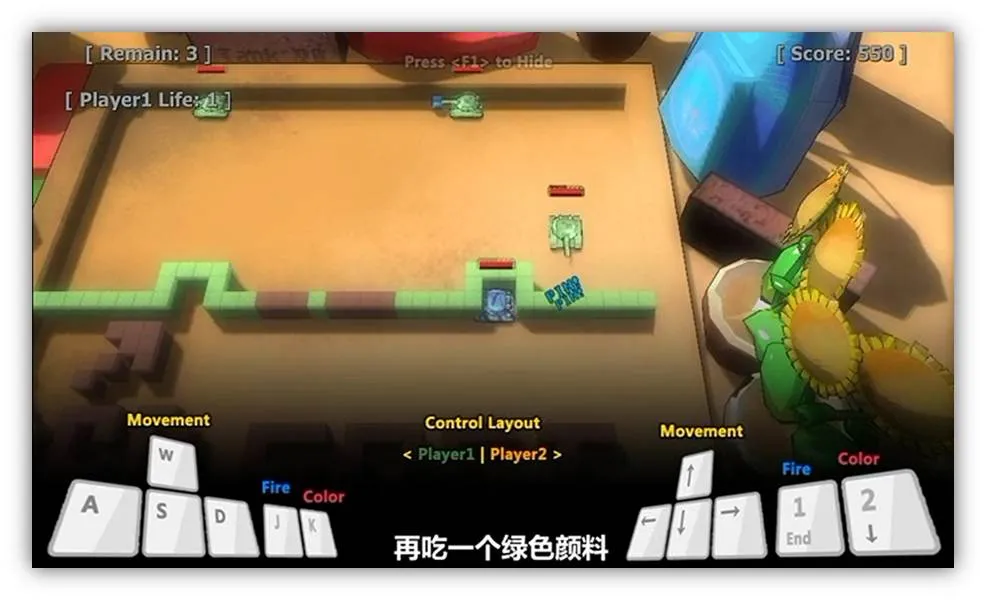
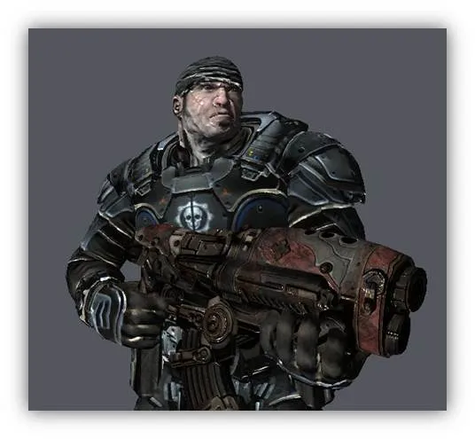
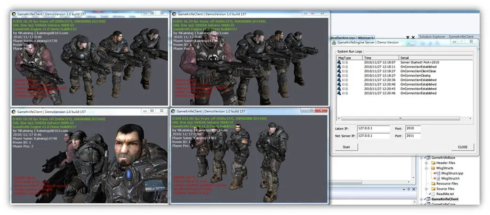
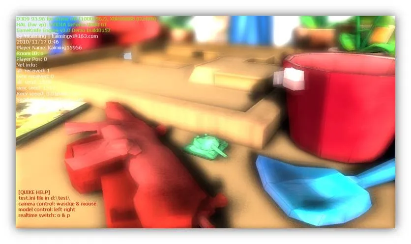
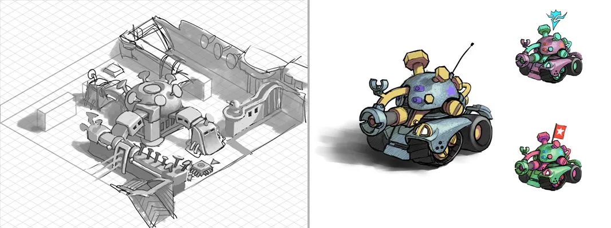
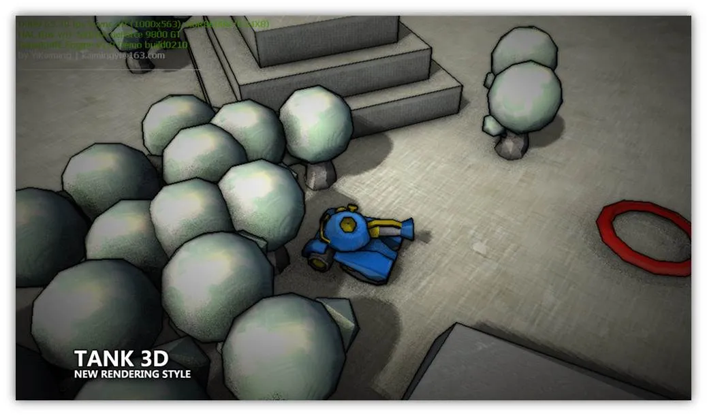
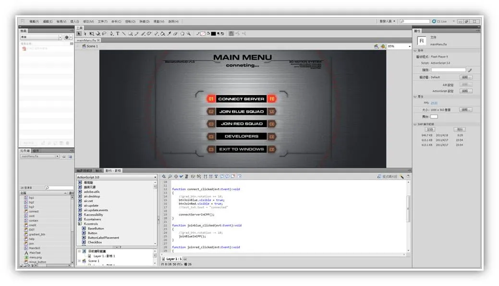
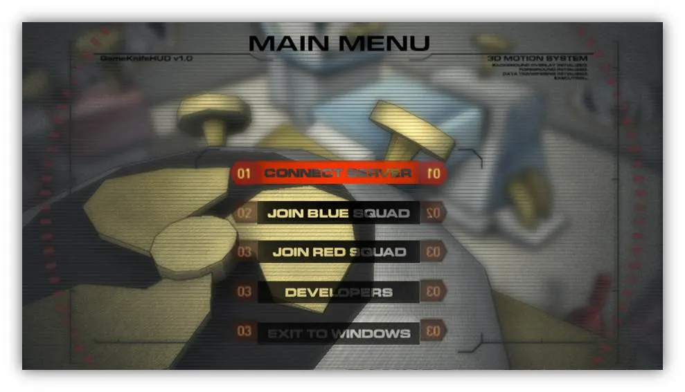

# 续

书接上回，今天距离睡觉还有两个小时，应该能把整个开发的流程带一遍。

感觉博客园里想要搞图形开发的学弟学妹还是挺多的~ 呵呵，希望这个开发流程能对你们有所帮助或者启迪！

最后，如果有任何疑问或意见，可以在后面跟帖。我知道的一定尽力回答~

# 3.开发流程

## 3.1 毕设开题 | 2010.7

去年7月，刚上大四，老师便通知我们，你们大四没课了，有课也是指导毕设，做毕设吧！（神马本科..一共四年最后一年就没课了）于是，我们在大三的暑假就没敢回家...扣破脑门开始想怎么搞毕设。其实吧，大四这么安排，主要是给我们去实习的，实习嘛，这毕设就得跟着实习挂钩。因此，我便锚定了走技术路线，不搞游戏创意和创作了，多练练技术，让以后工作有个更高的起点。（这点太有前瞻性了...）

于是，我们便决定 

“重构之前的游戏架构，制作一款多人联机对战游戏”

之前的TANK2010游戏截图

然后，便是在googlecode上面建立SVN空间，开始搭建工程的基础。

## 3.2 接触OGRE |
2010.8-2010.9

8月份开始，找到了第一份实习。开始接触大工程，啃了两个星期从未见过的硕大工程，终于鼓起勇气开始看OGRE源代码。一边看渲染核心流程，一边看各种分析文档。

OGRE的资源管理，渲染序列，材质排序，RT列表等概念都十分的好，让我越来越感到原来游戏框架的乏力。

终于，萌生了完全重做底层的想法，开始根据OGRE的构架，设计gkEngine的核心架构，开始画UML图。

## 3.3 痛苦的架构，设计 | 2010.9.14 – 2010.11.14

接下来，就开始导出UML图到基础工程（使用的是ZARGO这个软件来绘制UML图，该软件支持多种语言的基本架构导出），开始几个核心模块的设计实现

基本上总结下来就是一边看OGRE，一边写gkCore，搭建出OGRE
like的场景图结构，资源管理系统，渲染队列系统，RenderTarget队列系统。

同时，也开始研究OGRE等大工程的模块划分策略，开始设计gkEngine的dll模块划分

后来在实现上因为需要键鼠交互，使用DirectInput和WindowsAPI实现gkInput模块

同时开始考虑网络架构

设计材质，搭建继承体系的shader系统。作为练手，自己实现了顶点，像素版本的Blinn，Phong点光源，法线贴图，卡通渲染等材质。并且将光照计算和空间转换统一写在了shader头文件中引入，让shader系统更加结构化。

这两个月的时间是痛苦的，在前面的核心模块实现阶段，只有一次一次的compile，link。有时候会打一些断点来检测程序运行的正确性。过了很长一段时间，才开始进行能看到图像的测试，设计，测试...

## 3.4 第一次毕设检查，赶工 | 2010.11.14

11月初，收到了一个悲剧的消息，毕设检查！当然就开始了半个月的突击，gkCore开始了快速粗糙的进度追赶…

11月14号凌晨，毕设第一次检查，终于做出了一个直接挂载gkCore的小DEMO版本 (法线贴图问题严重…)

当时第一次答辩在台上忽悠（这个词不太好）老师们的小DEMO

## 3.5 搭建网络模块 | 2010.11.15 – 2010.11.31

毕设第一次检查的结果特别好（老师们被我忽悠住了...），接下来，开始考虑毕设的主要目标：网络通信。

首先是抽象出了一个gkGameSystem模块，这个模块类似于其他引擎的framework，在之前的gkCore和gkClient之间建立一层，用于游戏逻辑实现以及其他非图像功能的组合（例如网络，物理，其他资源等）。

之后，分析了一个现有的IOCP服务器和网络通信模型（这个网络模型是一个贵人留给我的，可以说，这个模型是一个对于学习和实践都特别好的模型）。

设计抽象出gkNetwork模块，用于网络通信基础类的设计，客户端和服务器都加载此模块进行网络通信。

再抽象出gkBase模块，建立网络包的基本模板结构，最后，基于一个现有的IOCP服务器框架开发出gkServer，在gkGameSystem中引入网络模块的gkNetLayer

实现了一个简单的用户登入登出的网络通信小demo。

这是我第一次真正意义上的接触网络编程，其中遇到了太多的问题。其中一个问题就是我错误的以为收到一个包就应该立即去获取。后来网络包发多了，就经常发生掉包的问题。这里又一个大哥给了我不少点拨，后来终于知道网卡底层的收发包机制，重写了获取网络包的逻辑，终于不丢包了。其实到现在，我也是买了一大堆计算机网络的书籍，却只在遇到问题的时候摸一摸，基本都没怎么看。说来比较惭愧，等以后有时间了，一定翻出来好好看看。

11月底完成的简单用户登入登出网络通信demo

## 3.6 内核继续开发 | 2010.12.1
– 2010.12.20

第一次毕设检查打乱了开发节奏…好些子模块的顺序颠倒，有些直接被绕过了。花了半个月的时间休整和完成了毕设的重要目标，因此这一阶段就可以静下心来开始整理和继续开发。

正是这一段时间，我接触到了openGPU这个论坛，这个论坛注册的形式挺好玩的，出了一大堆图形学的题，任意答对多少道才能获得注册资格~相当专业，不过还好，只要有计算机图形学基础的同学肯定是一点问题都没有的。进入openGPU后，接触到一些CryEngine的分析，一些延迟渲染的分析。到这个时候，我才知道，原来我之前的后处理架构其实就是一个延迟渲染架构，第一次听到延迟渲染架构的时候，还以为是多线程处理一些低频渲染，来达到真实多光源的效果...

所以，我开始将之前的后处理系统重构并引入gkCore。在gkCore加入简单延迟渲染架构，修改前向渲染的shader以输出MRT

同时，因为场景太简陋了，我开始思考地图编辑器的开发方案

## 3.7 内核继续开发 | 2010.12.1
– 2010.12.20

2010年12月20日，从第一家公司结束了实习，开始突击一周后的毕设检查。
这一周是效率最变态的一周，我完成了

> 

> 
- > 抽象出gkGameSystem的gkObject
> 
- 完成了3dsMax地图编辑器和gkEngine地图构建器的设计到开发
> 
- 在gkGameSystem引入gkPhysXLayer实现物理模拟和碰撞检测
> 
- 移植了多种后处理效果
> 
- 实现了完美的基于时间戳插值的网络数据包更新
> 
- 完成一个可以操控的多人联机DEMO
> 

当然一切都是hack方式完成的！gkObject是我目前比较得意的设计之一，他作为对gkCore中Entity的高层抽象，其中封装了包括 渲染方法，变换信息，物理模拟，事件回调，行为控制机等多个模块。使得其可以抽象出游戏世界的所有物体。之后，在开发基于3dsmax的地图编辑器时，我又将gkObject放进了max，让其作为游戏引擎物体在max中的一个表现，通过修改面板可以更改每一个gkObject所挂载的模型数据（模型文件）。然后赋予max自带的材质球。最后，导出场景时，导出器会搜索场景中的gkObject物体，并导出其所赋予的材质球，最后导出所有gkObject的模型文件信息和变化信息以及物理模拟信息。

相关的详细介绍我之前有篇博客有提到：

下面是当时的截图：

第二次检查时的地图编辑器

第二次检查时的客户端截图

## 3.8 客户端功能后续 | 2011.1.4
– 2011.1.22

第二次毕设检查后的日子，又开始安逸起来，我开始将之前客户端以hack方式制作的一些功能整理完善。

期间完善了技能编辑器，包括技能的更新和回馈可以继承子类来实现了。然后实现AI摄像机，“猜测”玩家的想法为玩家安排摄像机的视点，目前的游戏模式便是这样一种视点，使用了damping缓动技术，不会造成眩晕感！

## 3.9 毕设预答辩| 2011.2.28
– 2011.3.15

过完年，到现在公司实习了。学校也开始催毕设…

半个月的时间，配合着公司比较强力的任务... 我还是实现了服务器的房间线程，服务器客户端的逻辑数据结构，管理器。逻辑数据同步和更新。

技能方面，配合另一程序员实现了群伤，单体，加成BUFF，服务器丢道具的逻辑。

游戏模式改变为了TEAM DEATH MATCH游戏模式，因为之前类似于DOTA的想法太过于复杂了，平衡性也难以把握，因此我们选择了将游戏模式改为TDM，这样能够轻松的做出公平好玩的游戏。

终于3月16日，给老师们了一个可以联机对战的版本，几个老师在教室和我们联了一把TDM…

这次的预答辩也是以圆满告终！

## 3.10 美术风格调整| 2011.3.23
– 2011.3.31

动画的哥们儿完成了美术场景概念设计

美术概念设计

最后将场景风格重新确定为手绘感的淡彩风格，开始更改相应的shader配置

整体场景和战车重新建模

重新确定美术渲染风格

最后，应场景设计需求，构思设计了DeferredDecal技术，并增加相应的编辑器导出支持。

设计了简易的TimeOfDay系统，通过设置时间来改变太阳光角度和阴影的强弱以及环境光颜色。

## 3.11 第一次性能优化| 2011.4.1
– 2011.4.6

新增加的美术资源和shader大大加重了渲染压力，后处理的PS阶段成为瓶颈。

经过下列优化，从默认分辨率的50FPS左右提升到150FPS

> 

> 
- 修改了PostProcesser的处理方式，将复杂后处理内建，提升效率
>
> 
- 自适应的halfSSAO和quadSSAO
>
> 
- 优化第一版DeferredDecal Shader中的动态分支
>
> 
- 优化Shadowmap算法
>
> 
- 优化了模糊算法，只有DOF的模糊使用GAUSSIAN方式，其他采用BOX方式
> 

这一次优化，是gkEngine真正意义上的第一次优化。优化的程度不小，DOWNSCALE和后处理PASS上应该还有更多的优化空间，以后可以继续考虑优化方法。

## 3.12 引入3D
GUI系统|
2011.4.7 – 2011.4.17

随后开始写Vektrix的GameKnife插件，作为gkUI模块。之前研究了vektrix库很久，一直没有敢下手，也一直觉得无从下手。这一次确实是逼着要开始做GUI系统了，才硬着头皮上，还是很快的就写出了gkUI模块作为vektrix的插件，驱动了起来。

可是挂接gkEngine后在Pack贴图的时候数据流一直有问题，通过和作者stoneCold沟通，迅速的突破了

> 

> 
- Pack贴图
> 
- 分层设置Depth
> 
- As3和cpp的通信
> 

等问题。快速的引入了flash3DGUI，同时，使用flash IDE来制作GUI和GUI的交互可比之前的硬编码强太多了，速度快，效果好，交互多。

在FlashIDE中编辑GUI和GUI的交互（as3脚本编写）

编辑好的GUI层在引擎中的3D显示和交互

## 后记

不知不觉，简单的一个开发流程竟然写了两个小时，该睡觉了，却还觉得写得意犹未尽，有些地方没有说清楚。等以后有机会再整理一版吧~

一路的开发历程整理下来，发现还真是一段辛酸血泪史啊，这半年来的开发线算下来，我总共写了2W多行代码。其中gkCore图形核心占据了12K行，其他的客户端，网络模块等占据了将近10K行。

这半年每天过着白天上班敲代码，晚上毕设敲代码的日子，每天12点睡，7点起，在地铁上站着睡觉....

不过真的很充实，也确实感到进步了很多很多，感谢期间帮助我的大哥们，你们真的是我人生中的贵人！

的确在公司的实践让我真正的成为了一个程序员，一个图形开发人员。

想到去年10月，我正在公司的电脑上敲着代码，接到了学校保研面试的通知，毅然决然的跟辅导员说了：我放弃...

回头的几个星期...才慢慢含沙射影的给父母讲了这个我自己的决定...

父母从开始的气愤不理解，慢慢看到我的成长和发展，现在基本上已经接受了我当初太过“盲目”的决定。我相信，继续努力吧，他们以后会为我做的这个决定而高兴的！
