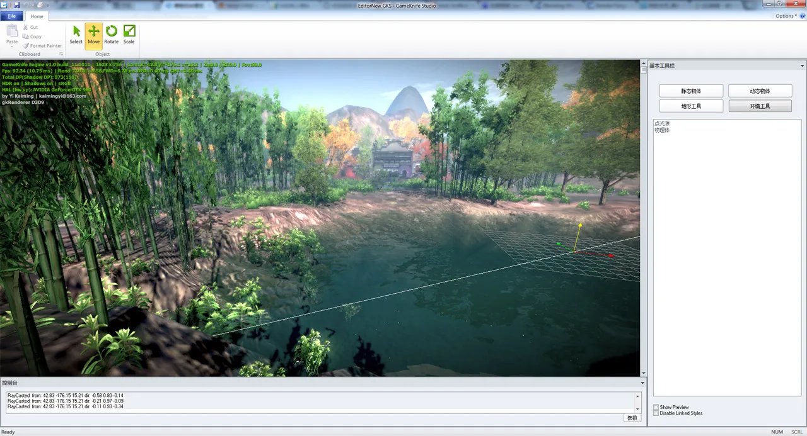
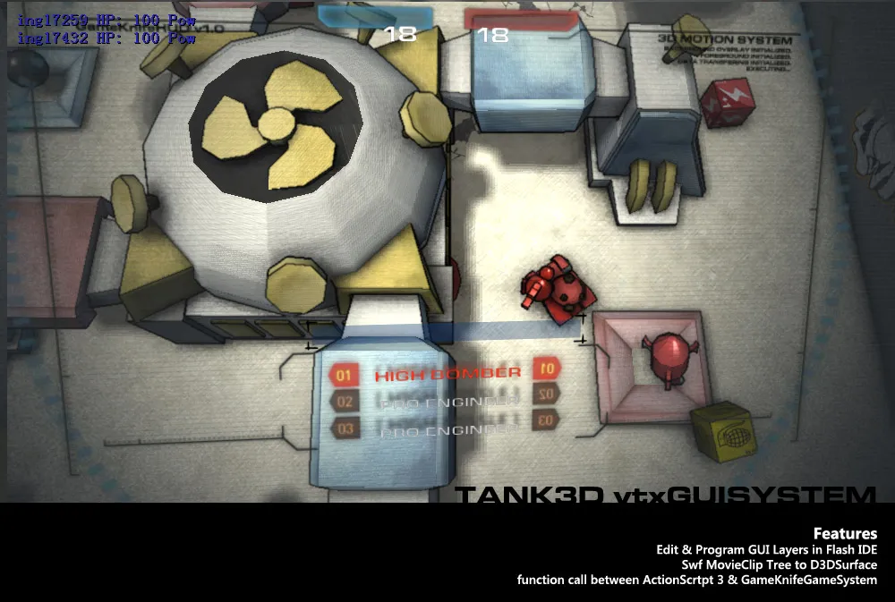
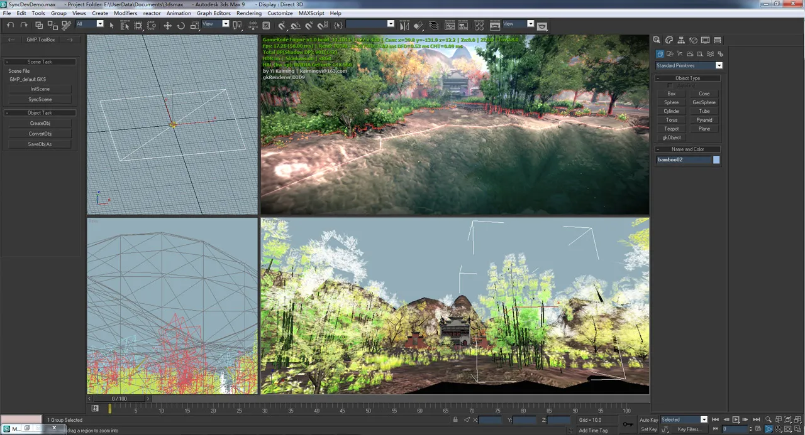

# 启

上一篇日志，已经是四月份的了。

转眼过去，工作半年了。看到当时写的文章，感觉这半年，成长很明显。

先放两张对比图

目前的gkENGINE编辑器截图

毕设结束时的gkENGINE

# 承

毕业后的工作，就从实习转全职了。工作重心基本从工具转移到了动画系统和项目支持上。

可能是初生牛犊不怕虎吧，从来没有做过系统的动画系统，开始啃引擎的动画部分。逐渐熟悉了一个高效的动画系统驱动方式，并且扩展和优化了IK计算。

项目支持，得益于我对各种软件的敏感，以及美术基础。做得算是有声有色，在项目里和相当数量的同事混的很熟。

工作的事情，总之有条不紊，步伐稳健。

最近的成果评审，也很顺利。

但却感觉一直这样的话，有些平淡。

毕竟一直维护和扩展一个现有的庞大工程，似乎并不太能快速的成长。

# 转

因此，毕设的gkENGINE，又重新启动了。目前gkENGINE经历了一次完完全全的重构，基本所有文件都动了一遍，历时1个月。

目前区分为了：场景管理，渲染器，输入输出，网络，物理，系统等六个相互独立的DLL模块，取消了之前各个模块之间的相互依赖，转而用接口的方式建立联系。

因此，所有模块工程均可以并行编译链接，大大提高了编译速度，同时提高每个模块修改的链接速度。

同时，开发了gkStudio这样的一个编辑器启动方式，将原来的启动方式保留为Launcher，还增加了一个3DS MAX视口渲染器，这样，可以通过三个不同的入口启动引擎开始目的不同的工作。

之前的GameSystem模块，GameServer，Base模块暂时移出项目，以后考虑在系统模块上，添加一个Framework来做游戏逻辑。

重构之后，又对渲染系统进行了一次大修改。彻底的修改了原来OGRE like的渲染流程。

首先在后处理器内实现了内建HDR处理，并添加了shader雾和色彩校正，GAMMA校正等图像处理shader。最后添加了EDGE AA的简单抗锯齿。并优化提升了后处理的性能。

DIABLO3出宣传视频的时候，自己实现了一套类似的 “外发光” 处理，使用了一个后处理实现。

然后，在引擎中实现了Deferred Lighting，视空间法线贴图，实现了任意多点光源的渲染和全局的法线计算。

最后，做了一直想做却没有做的水体渲染。目前引擎的某些特性指标，应该是达到了次时代标准。

还有一个比较好玩的功能是3DS MAX视口渲染器，我在MAX中开了一个子线程来启动引擎和创建第二D3D设备，使用引擎进行渲染。并将渲染结果绘制到MAX视口上。同时，每一帧将MAX中的摄像机参数同步回引擎，每当操作时，将MAX中的场景写入场景文件，通知引擎载入（会根据场景变化，修改原有的物体，删除变更的物体，添加新增的物体）。同时实现了MAX SCRIPT和MAX 插件的互相调用，在MAX SCRIPT实现了一个浮动工具面板，提供一些创建引擎物体，同步场景，提交mesh修改等功能。基本实现了一个在3DSMAX中的编辑器雏形。

gkMaxPort同步开发截图

正是在一边实现这些功能，一边阅读paper，读crysis2的shader，用perfHUD和GPA挂CryENGINE3 SDK的渲染流程分析。使得进步十分明显，同时也一直有一个实实在在的东西，提醒自己不断努力。

# 合

目前gkENGINE的渲染效果已经比半年前毕设那个版本有了天翻地覆的变化了，一直赶路，却没有时间回头看看。

今天回头看看，其实已经实现的功能里面，还是有好多东西搞得不是特别明白，正好，接下来，每个星期写一个技术的实现细节，回顾和总结一下。

大概列一下：

1. 原创的，Diablo3 Like的逐物体外发光效果实现。

2. DeferredLighting渲染流程设计，CryENGINE3 SDK的渲染流程分析。

3. 水体渲染，流程及着色。

4. MAX视口渲染器的简单搭建方式，MAX SCRIPT和MAX 插件互相调用的应用。

接下来一个月，一个星期写一个，既是总结，也是分享吧~

接下来，将HDR流程再优化整合一下，差不多应该放松放松，回归做一些编辑器的功能了，使得引擎更加容易配置和调节。

然后，就要开始啃一个更大的骨头：动画系统。从来没搭建过，摸着石头过河吧！

以上，算是这六个月的总结。
