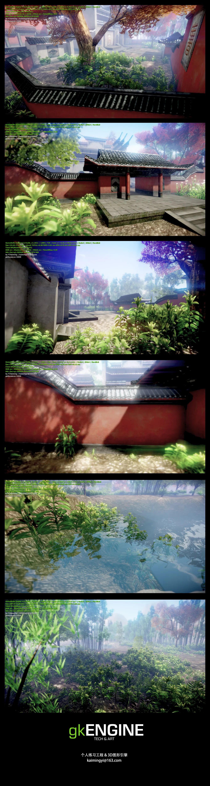
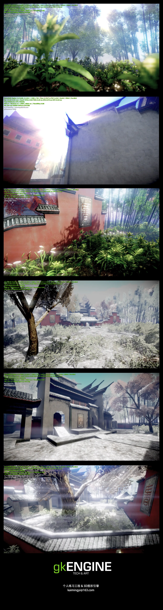

# Header

总结文章如期的爽约了...

这个月工作太忙...有好多突破...另外，我发现之前做法有些笨拙，同时发现需要总结的东西，还需要进一步深入了解。所以，如期爽约，不过它会有到来的一天。

# gkENGINE 最新效果

1

2

引擎特性： 大量光源延迟光照, 屏幕空间环境遮蔽, 级联阴影贴图, 软半影阴影, 景深, 完全HDR渲染, 后处理MSAA, IBL光照, 高级水体渲染，体积光， 后处理雪景

最近一直想停下来不做渲染了，可是一直想做。今天可以算作一个节点了，渲染流程基本梳理完成，实现了后处理的雪，postMSAA最终也做成了！

画面效果整体基本不需要再强化了。

刚做了优化，720p场景平均是130FPS @ NV GTX560

接下来梳理一下代码和流程，重构一些丑陋的地方，总结回顾。然后就开始看HAVOK！立贴为证！

最后，之前提到的关于CE3 FREESDK渲染流程梳理，已经着手做了~
