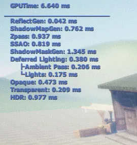

# 序

最近想给引擎加一个准确定位各渲染模块消耗的功能，因此翻阅资料，自己实现了一个简短的GPU时钟。在引擎中整合如下：



值得注意的是，使用硬件查询后，回读显卡中的值会导致CPU/GPU的等待，因而会损失一些时间。因此这个功能只能算作开发时的调试工具之用（真正产品不会有人关心GPU时间...）

我昨晚花了少量时间做了一个简单的实现，现在在这里贴出来，基本是全部代码，摘回去可直接使用~ 如有设计上的疏忽还请见谅！

该计时器使用十分方便，集成好之后，测量每个阶段的时间，只需补上3条代码，即可~

# 原理

D3D文档中提到了有这样一个硬件查询类型：D3DQUERYTYPE_TIMESTAMP

该硬件查询会在查询的地方，返回一个UINT64类型的当前的GPU TICK值，因此，可以使用这个来取得每个模块的开始和结束TICK，在每帧结束的时候GETDATA，计算出每一个阶段的耗时

此外，D3DQUERYTYPE_TIMESTAMPFREQ这个查询类型，可以返回时钟频率，这时我们便可以通过 （结束TICK - 开始TICK） / 时钟频率 来得出GPU中这一段的耗时了。

# 实现

因此，我们可以实现一个简单的GPUTIMER类:

```cpp
class gkGpuTimer
{
public:
 gkGpuTimer();
 virtual ~gkGpuTimer() {}

 float getTime() {return m_fElapsedTime;}

 // init D3DQUERY
 void init(IDirect3DDevice9* pDevice);
 void destroy();

 // mark the timestamp
 void start();
 void stop();

 // get timestep when finish a frame
 void update();

private:
 IDirect3DQuery9* m_pEventStart;
 IDirect3DQuery9* m_pEventStop;
 IDirect3DQuery9* m_pEventFreq;

 float m_fElapsedTime;
 bool m_skip; // judge if should get data
};
```

很简单

一对init()，destroy()，在设备创建和丢失的时候对D3D对象进行重建和释放

一对start()，stop()，在需要测量的代码段两边放置，分别取得开始和结束的TIMESTAMP和FREQ

一个update()，在每帧结束的时候，从GPU取得测量值，计算之后存储于m_fElapsedTime中

m_skip用于判断是否应该从GPU取值，因为由于渲染流程的改变，有些计时器可能在一些情况下并不会测量。

下面看一下简单的实现

（注: gEnv->pCVManager->r_ProfileGpu == 1 是我引擎中的参数，为1时表示打开GPU计时）

```cpp
gkGpuTimer::gkGpuTimer()
{
 m_pEventStart = NULL;
 m_pEventStop = NULL;
 m_pEventFreq = NULL;
 m_fElapsedTime = 0.0f;
 m_skip = true;
}

void gkGpuTimer::init(IDirect3DDevice9* pDevice)
{
 // initialze the querys [2/2/2012 Kaiming]
 pDevice->CreateQuery(D3DQUERYTYPE_TIMESTAMP, &m_pEventStart);
 pDevice->CreateQuery(D3DQUERYTYPE_TIMESTAMP, &m_pEventStop);
 pDevice->CreateQuery(D3DQUERYTYPE_TIMESTAMPFREQ, &m_pEventFreq);
}

void gkGpuTimer::destroy()
{
 SAFE_RELEASE( m_pEventStart );
 SAFE_RELEASE( m_pEventStop );
 SAFE_RELEASE( m_pEventFreq );
}

void gkGpuTimer::start()
{
 if( gEnv->pCVManager->r_ProfileGpu == 1 )
 {
 // get start time stamp and freq
 if (m_pEventStart)
 m_pEventStart->Issue(D3DISSUE_END);
 if (m_pEventFreq)
 m_pEventFreq->Issue(D3DISSUE_END);
 }

 m_skip = false;
}

void gkGpuTimer::stop()
{
 if( gEnv->pCVManager->r_ProfileGpu == 1 )
 {
 // get end time stamp
 if (m_pEventStop)
 m_pEventStop->Issue(D3DISSUE_END);
 }

 m_skip = false;
}

void gkGpuTimer::update()
{
 if( gEnv->pCVManager->r_ProfileGpu == 1 )
 {
 UINT64 startTime = 0;
 UINT64 endTime = 0;
 UINT64 freq = 1;

 if (!m_skip)
 {
 // at the end of a frame, getdata from device
 while(S_FALSE == m_pEventStart->GetData( (void *)&startTime, sizeof(UINT64), D3DGETDATA_FLUSH ))
 ;
 while(S_FALSE == m_pEventStop->GetData( (void *)&endTime, sizeof(UINT64), D3DGETDATA_FLUSH ))
 ;
 while(S_FALSE == m_pEventFreq->GetData( (void *)&freq, sizeof(UINT64), D3DGETDATA_FLUSH ))
 ;

 // calculate the elapsedtime in microseconds
 m_fElapsedTime = (float)(endTime - startTime) / (float)(freq) * 1000.0f;
 }
 else
 {
 m_fElapsedTime = 0.0f;
 }
 }
 m_skip = true;
}
```

最后，就是集成到渲染流程中了，我实现了几个简单函数，在渲染流程的恰当阶段调用即可

(注：ms_GPUTimers为我渲染器的一个静态成员)

```cpp
typedef std::map<std::wstring, gkGpuTimer> gkGpuTimerMap;
```

```cpp
// build gpu timers when init renderer
void gkRendererD3D9::buildGpuTimers()
{
 ms_GPUTimers.insert( gkGpuTimerMap::value_type( L"GPUTime", gkGpuTimer()) );
 ms_GPUTimers.insert( gkGpuTimerMap::value_type( L"ReflectGen", gkGpuTimer()) );
 ms_GPUTimers.insert( gkGpuTimerMap::value_type( L"ShadowMapGen", gkGpuTimer()) );
 ms_GPUTimers.insert( gkGpuTimerMap::value_type( L"Zpass", gkGpuTimer()) );
 ms_GPUTimers.insert( gkGpuTimerMap::value_type( L"SSAO", gkGpuTimer()) );
 ms_GPUTimers.insert( gkGpuTimerMap::value_type( L"ShadowMaskGen", gkGpuTimer()) );
 ms_GPUTimers.insert( gkGpuTimerMap::value_type( L"Deferred Lighting", gkGpuTimer()) );
 ms_GPUTimers.insert( gkGpuTimerMap::value_type( L"Ambient Pass", gkGpuTimer()) );
 ms_GPUTimers.insert( gkGpuTimerMap::value_type( L"Lights", gkGpuTimer()) );
 ms_GPUTimers.insert( gkGpuTimerMap::value_type( L"Opaque", gkGpuTimer()) );
 ms_GPUTimers.insert( gkGpuTimerMap::value_type( L"Transparent", gkGpuTimer()) );
 ms_GPUTimers.insert( gkGpuTimerMap::value_type( L"HDR", gkGpuTimer()) );
 ms_GPUTimers.insert( gkGpuTimerMap::value_type( L"PostProcess", gkGpuTimer()) );
}

// init gpu timers when device reset
void gkRendererD3D9::initGpuTimers(IDirect3DDevice9* pDevice)
{
 gkGpuTimerMap::iterator it = ms_GPUTimers.begin();
 for (; it != ms_GPUTimers.end(); ++it)
 {
 it->second.init(pDevice);
 }
}

// release gpu timers when device lost
void gkRendererD3D9::destoryGpuTimers()
{
 gkGpuTimerMap::iterator it = ms_GPUTimers.begin();
 for (; it != ms_GPUTimers.end(); ++it)
 {
 it->second.destroy();
 }
}

// getdata from gpu when a frame end
void gkRendererD3D9::updateGpuTimers()
{
 if(gEnv->pCVManager->r_ProfileGpu == 1)
 {
 gkGpuTimerMap::iterator it = ms_GPUTimers.begin();
 for (; it != ms_GPUTimers.end(); ++it)
 {
 it->second.update();
 }
 }
}
```

使用了map结构，因此在设置计时器的时候就特别方便了，比如：

```cpp
gkRendererD3D9::ms_GPUTimers[L"SSAO"].start();
```

```cpp
// ssao render process...
```

```cpp
gkRendererD3D9::ms_GPUTimers[L"SSAO"].stop();
```

添加完毕后，在想要拿时间的地方，

```cpp
gkRendererD3D9::ms_GPUTimers[L"SSAO"].getTime()
```

即可。

# 总结

自此，GPUTIMER全部完成，用了不到200行代码。

使用上，就是

```cpp
ms_GPUTimers.insert( gkGpuTimerMap::value_type( L"测量名", gkGpuTimer()) );
gkRendererD3D9::ms_GPUTimers[L"测量名"].start();
gkRendererD3D9::ms_GPUTimers[L"测量名"].stop();
```

三条代码，当然如果加上一些宏技巧，可以更加工程化一些~

# KISS
