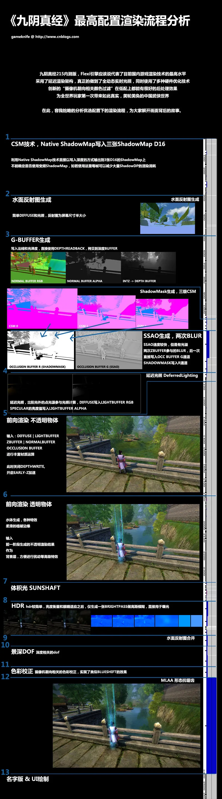

周三体验了九阴真经，画面的确很棒。

渲染技术也较为现代，使用了延迟光照，真正全动态光影，应该算得上国内自研引擎渲染效果的最高水平了。

字都在图里了，不让发... 重复下凑字吧~

九阴真经215内测版，Flexi引擎应该说代表了目前国内游戏渲染技术的最高水平

采用了延迟渲染架构，真正的做到了全动态实时光照，同时使用了多种硬件优化技术

创新的“摄像机朝向相关颜色过滤”在低配上都能有很好的后处理效果 为全世界玩家第一次带来如此真实，美轮美奂的中国武侠世界

在此，容我拙略的分析优选配置下的渲染流程，为大家解开画面背后的故事。

以图代文。这次是简要的流程叙述，以后再分模块仔细分析！
