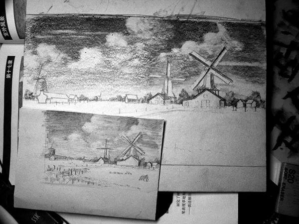
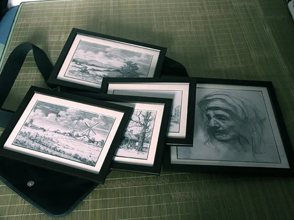
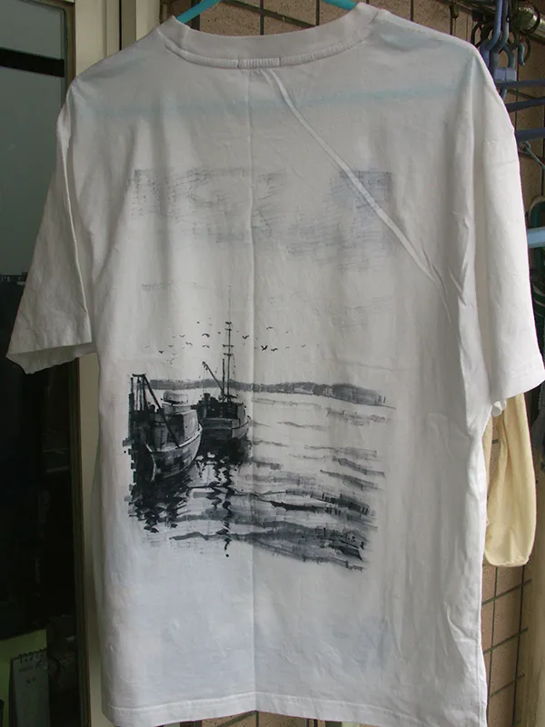
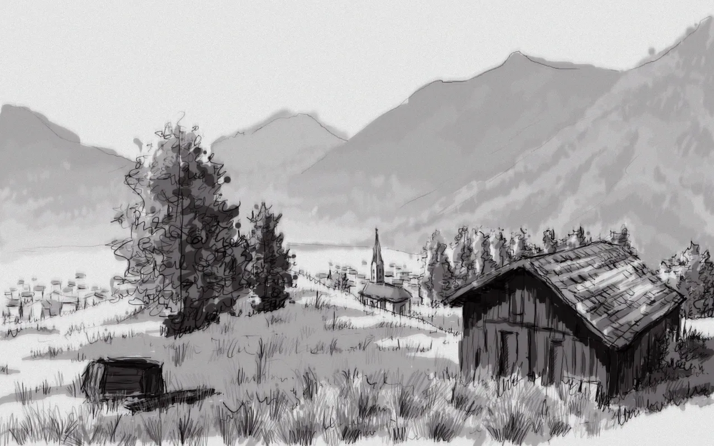
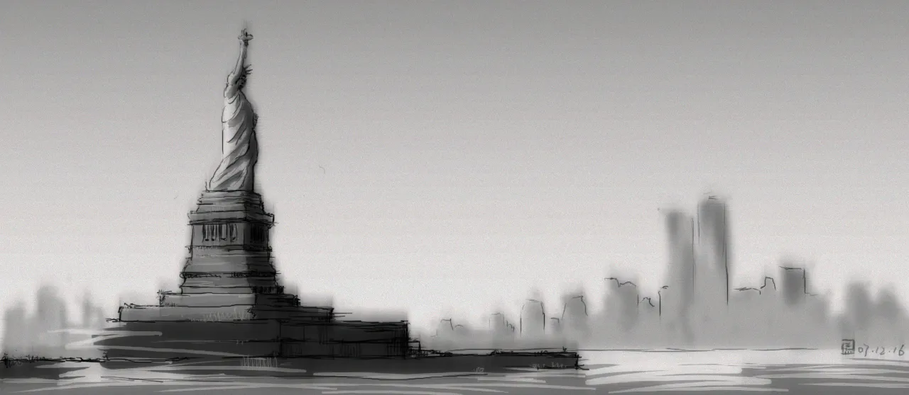

这两天，翻出来以前画的一些画。

话说3年前还幻想过以后做游戏美术，这些都是高中和大一大二的画了。

现在作为一个标准 programmer， 把这些画放技术博客上还有点意思~

高三时候，买了本《铅笔风景》，跟着买了好多牛逼的自动铅笔，跟着学笔触，临摹和创作了挺多~

都是铅笔素描。

这个比较有意思，当时买了马克笔，想练习建筑手绘（其实当时的主要志向是学建筑...），然后发现用马克笔在衣服上作画挺有意思，

还有点国画里晕染的味道。

大一买了数位板之后画的一张画，不太懂数位板的笔怎么用，笔触就只能草，草，草...

后来画的一张，嗯，重温MGS2以后画的，这张其实完成得很快。感觉不错~

自从大二后半期，走上了coding的不归路... 我好像真是再没有握过笔...

然后转眼就从文艺青年变成了coder monkey，以后有机会一定要抽时间重新温习温习啊~

而且其实，作为一个图形程序员，美术方面也应该继续进修才对~
