# 小刀的由来

gkENGINE，gameKnife engine，小刀引擎。

这是一个完全个人开发的游戏引擎项目，起源于我的大学毕设。当时是希望开发一个能够全面支撑毕设游戏的游戏底层架构，同时也磨练一下自己的图形技术。在毕设游戏开发完成之后，就开始纯粹的进行引擎重新架构和开发。到目前为止，断断续续，开发了应该有两年半的时间了。

 从2010年9月开始构思毕设，到2011年6月毕设完成，gkENGINE第一版随着毕设游戏《TANK ZONE》完美收官。

再到2011年7月，开始构思gkENGINE渲染特性扩展。

再到2011年末，对CryENGINE有足够了解之后，开始对gkENGINE进行彻底重构，实现多线程渲染。

再到2012年中，对gkENGINE进行了跨平台改造，对移动开发环境的学习，部署，成功把gkENGINE搬到IOS和Android平台。同时重构了渲染器，使得其可以以不同的渲染档次来适配

再到2013年初，经过开发软渲，以及一系列几何构建，动态模拟之类的学习积累后。快速的开发了gkENGINE的地形系统，GPU粒子等雏形功能，多线程加载等功能。

再到2013年的现在，开发了测试用例模块，对资源管理进行了小型重构，渲染效果调优。

两年半的时间，好像从来没有对小刀引擎进行一个系统的分析。趁着最近这段比较痛苦却空闲的时间，对小刀引擎进行第一次系统总结吧！

# 引擎特性

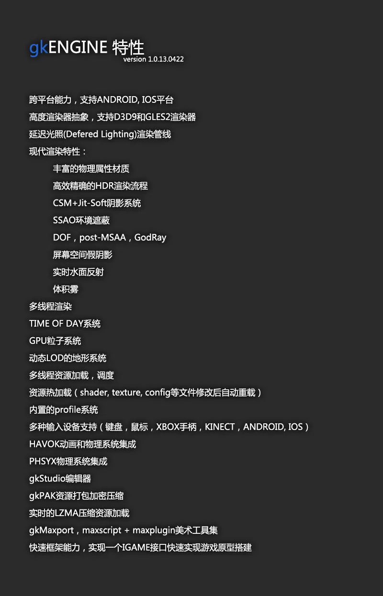

下面按照惯例，上点图吧~ 今晚现拉了一个场景，打了几盏带假阴影的灯。

图都是2000px宽的大图，各位看官可以右键在新标签中看原图。

**1。**

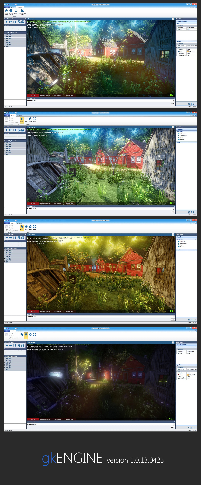

2。

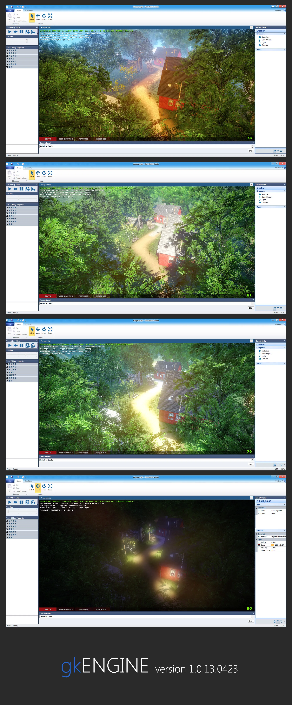

3。

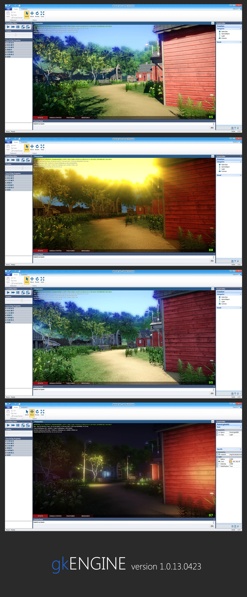

4。

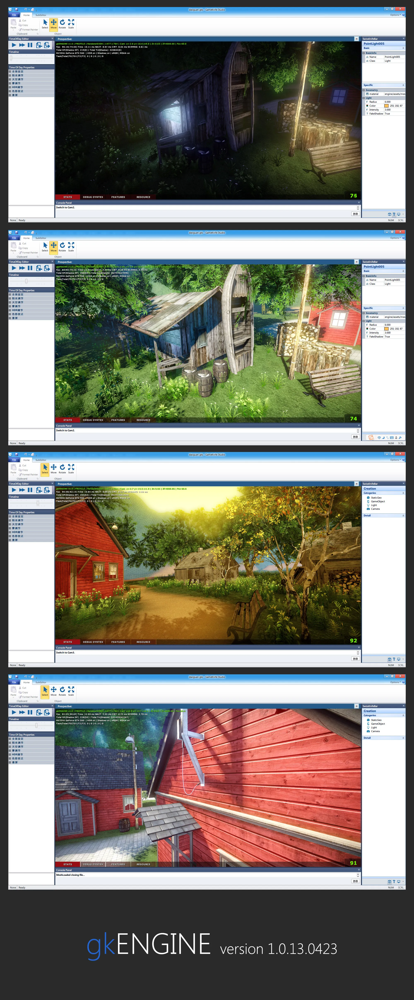

5。

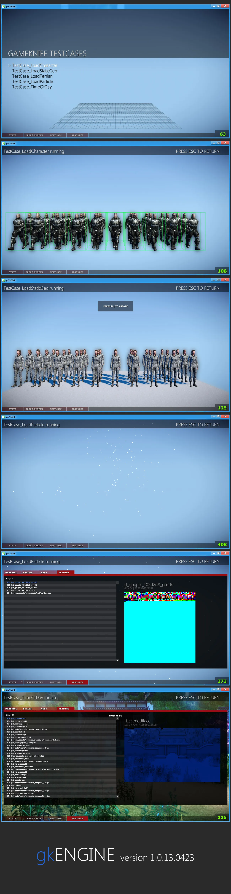

# 引擎架构

引擎一开始是参考OGRE进行架构的，后来发现OGRE的一些思想过于陈旧，同时接触了CryEngine，于是重构了目前的这套架构。目前的架构由8个独立模块构成。独立是指：每个模块完成一部分相对独立的事务，之间的联系由抽象的接口维系。各自的内部实现保持独立。8个工程可独立编译，只通过约定的抽象接口进行相互调用。

## 模块划分：

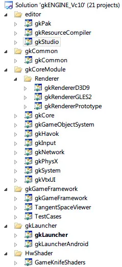

目前引擎主干分为8个模块：

**gkRenderer：渲染器**

其下目前实现有RendererD3D9和RendererGLES2，细节渲染特性在渲染器内部提供支持。例如shadow, hdr, postmsaa, ssao, deferred lighting等。

**gkCore：3D空间内核**

其主要实现3D世界的管理，以及各种资源和渲染物件的组装和统筹，渲染队列的构建。

**gkSystem: 系统模块**

主要负责是整个系统的协调，task处理系统，文件/PAK系统维护，以及和操作系统提供的接口打交道，将其他模块和平台特性解耦。

**gkInput: 输入模块**

负责各种输入设备的管理和消息处理，将来自键盘，鼠标，手柄，kinect，Android触屏，IOS触屏等各种输入设备的输入抽象为共有的消息。利用listener模式，为各模块和游戏逻辑实现提供交互支持。

**gkHavok: Havok动画和物理模块**

目前Havok模块负责两块：动画和物理。动画模块提供ICharacter来提供角色骨骼动作支持，物理模块提供各种物理层抽象来提供物理支持。

**gkPhysics: PhysX物理模块**

PhysX物理模块单独实现物理层抽象。

**gkGameObjectSystem: 游戏物件系统**

游戏物件系统提供了游戏中最基础节点：游戏物件的管理。采用了component模式，通过各种layer的组合来组装各种不同类型的gameobject。renderlayer, animlayer, physiclayer, lightlayer等等layer来和其他模块打交道。

**gkGameFramework: 游戏框架**

游戏框架建立了一个宏观的游戏驱动架构，提供一个Igame接口供外部实现游戏逻辑。以快速驱动游戏引擎，快速开发游戏逻辑。

**gkLauncher: 启动器**

各平台不同的启动器负责在各个平台建立游戏框架并驱动引擎。目前实现有gkLauncherWin32, gkLauncherAndroid, gkLauncherIOS。

其他模块：

**gkCommon: 接口工程**

该工程不参与编译，是对所有接口的一个归类和管理。

**gkStudio：小刀编辑器**

小刀编辑器是一个基于MFC的，使用XTP开发的编辑器架构。提供对游戏场景的编辑。

**gkPak: Pak工具**

gkPak负责利用平台配置，将各平台所需资源文件 打包/加密/压缩 为各个平台的资源包。

**gkResourceCompiler: 资源编译工具**

资源编译工具主要负责各种资源的处理，目前提供obj2gmf，tga2dds等源文件到执行资源的资源转换。

## 顶层接口和设计思路：

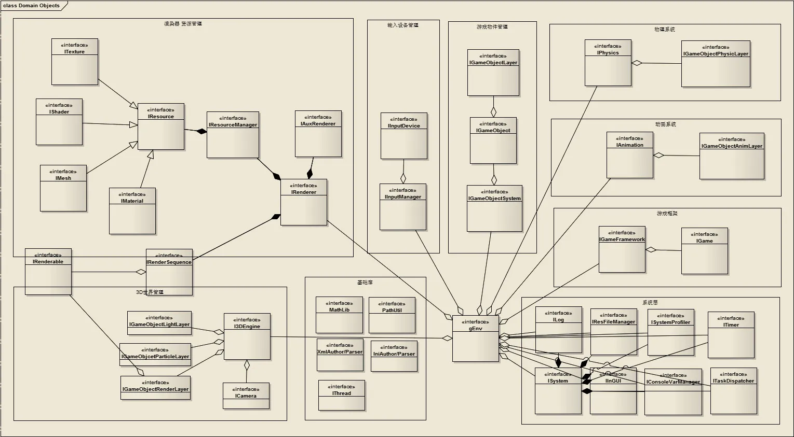

顶层的接口设计，就是对模块划分的一个细化。今天大概的拉了一个图，把各个模块的职能接口关系理了一下。

这张图可从gameobjectsystem的IGameObject这个抽象说起：

首先，一个IGameObject抽象，就代表游戏世界中的一个物体（一个石头，一个人，一盏灯，一个抽象对象，等等）。

其上使用Component模式，组合了多个IGameObjectLayer，这些Layer有具体的抽象：渲染层，物理层，动画层，灯光层，粒子层，xxx层。例如一个石头，需要一个渲染层和物理层即可；而一个人，则需要多一个动画层；一盏灯，则需要渲染层和灯光层，或者只需灯光层。

这些Layer，就在各个模块拥有自己的实现：

例如渲染层，是在GKCORE中实现，创建时加载其所需的各种资源，并按照摄像机和物体的裁剪关系，把他送入渲染队列，让渲染器将其渲染出来。

例如动画层，是在GKHAVOK中实现，创建时加载其所需的各种资源，在更新时更新角色骨骼的数据，将信息填入渲染队列，让渲染器将其正确的姿态渲染出来。

例如物理层，是在GKHAVOK中实现，在更新时，根据物理规律，更新其位置或形态，更新渲染层的位置，渲染器最后将其渲染在正确的位置。

等等...

渲染层的具体实现，是这个引擎的图形部分的核心。放在之后章节具体解析。

## 数据和简单工作流：

**小刀引擎的数据，目前有**：

几何网格：.gmf

纹理：.raw .dds .pvr

材质: .mtl

shader d3d9: .fx .fxb

shader gles2: .vfx .ffx

场景：.gks

动画文件：.hkx .chr

配置文件：.cfg

打包文件: .gpk

**目前静态物体的工作流是：**

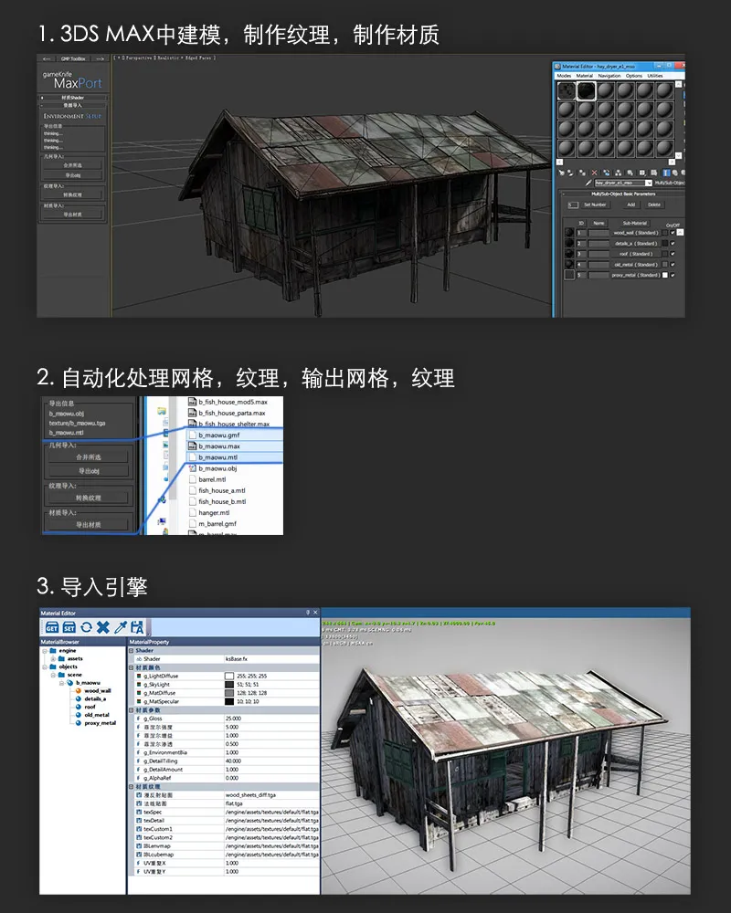

 编写了一套轻量级的 maxscript + maxplugin的maxport插件组，方便快捷的制作美术资源和（导出场景* 场景编辑也可以直接在MAX中完成）

**目前的角色工作流是：**

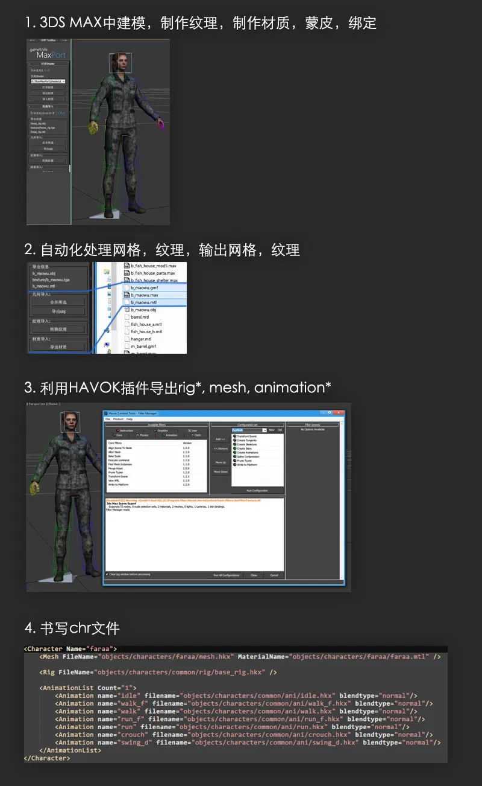

角色骨骼动画方面完全使用了HAVOK提供的便捷工具链，异常方便。以后chr的撰写工作可以制作为max中的工具。

**文件打包和平台版本更新：**

目前开发了一个PAK打包工具，将文件分别用LZMA压缩（可配置），打包到一个gpk文件中。在引擎中实时的LZMA解压和加载。

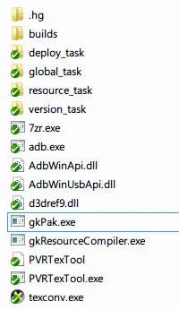

目前的工具集，外部提供了pak工具，资源编译工具，纹理转换工具，7z再次打包工具，android的adb工具。

通过windows bat命令集，来调度各种工具，完成对资源的处理，筛选，针对平台打包，向移动平台（android, ios）更新数据包等任务。

 一天就这么写过去了，上节就先写到这里。下节详细总结渲染系统的搭建，以及小刀以后的发展想法。
