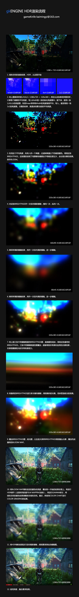

个人比较喜欢看图说话。

这里简单的用图和文字说明一下gkENGINE HDR渲染流程中的关键步骤。如果要一步一步的解析，光是解释RT的创建，释放，纹理格式的选用。可能就需要一整天。如果再涉及到框架搭建，shader的实际处理，可能几天都不够。所以这里就不详细进行代码层面的讲解了。

不过这里列举几个非常关键的地方：

- **线性空间的重要性:** 保持光照运算在线性空间是十分重要的。只有在线性空间进行运算，才能保证光照的结果真实可信。

- **浮点纹理：**HDR的运算和RT一定使用浮点纹理，8位的纹理不足以表达如此精准的明暗细节。

- **纹理尺寸：**纹理尺寸的选择要仔细斟酌。浮点纹理对显卡带宽的占用非常巨大，在保证精准的前提下，能省就省。

这个流程供图形好友们参考，权当抛砖引玉了！欢迎交流！
