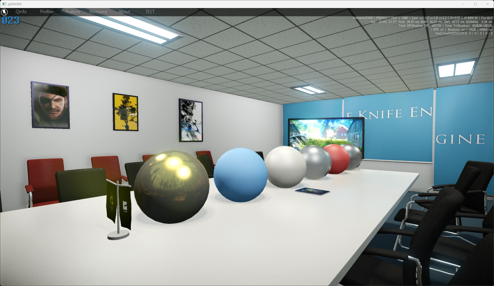
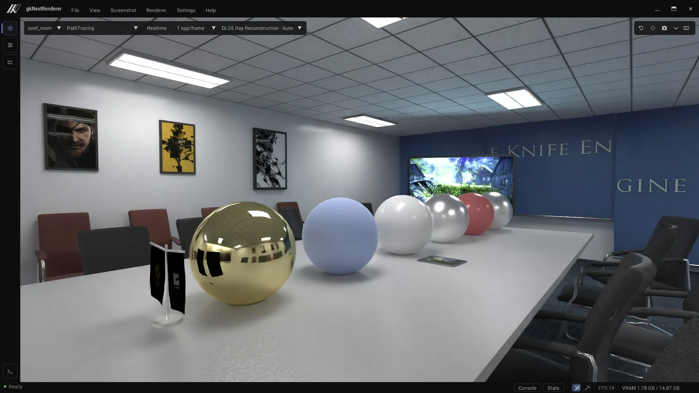
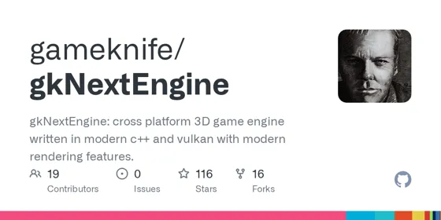
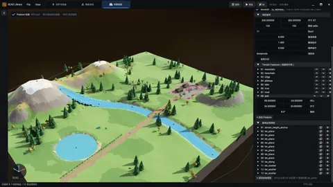

<p align="center">✦</p>

> 说明一下：这篇的内容和判断都是我自己的，AI 帮我理了理结构和文字。后面应该都会这么和 AI 协作写作。

先看两张图，这是当年 gkEngine 后期致敬 FoxEngine，自己照着当时畅游会议室搭建的一个场景。





同一个场景，同一个机位，中间隔了十五年。

conf_room 是 gkEngine 当年的样板间——延迟光照、准 PBR、HDR 后处理，那时候能拿出手的东西基本都堆在这一个房间里。

这组对比是为了这篇文章现做的。gkEngine 那个仓库 2015 年之后就没再动过，我先把它修到能跑：启动脚本、DDS 压缩、color grading、SSRL、env2d 的一堆老 bug，然后写了个 `gks2glb.py`，把自研的 `.gks` 关卡格式导成 GLB。conf_room 搬进 gkNextEngine 之后，再按老引擎 `.cam` 文件里记下的机位对齐，才有了上面这两张图。

同一个会议室，隔着十五年，我自己看着也挺感慨的。

<p align="center">✦</p>

2010 年我开始写 gkEngine，这是我本科的毕业设计，一直做到了从第一家公司毕业。

OSX / iOS / Android / Windows 都能跑，DX9、GL3、GLES2 可以切。延迟光照、准 PBR、HDR 后处理、多 LOD 地形，这些当时算先进的活儿都接了。图形圈里有些人知道它，算是小有名气。

做到 2015 年，之后这个项目就基本不再动了。

2024 年 5 月，我开了一个新仓库。gkEngine 还在用 d3d9，代码写法也过于老旧，而我看了一眼最新的 Vulkan，发现自己根本看不懂现代渲染长什么样了。所以我需要一个全新的项目来学习现代渲染：gkNextRenderer，一个实时渲染器。

代码本身我还读得懂，真正陌生的是现代渲染这十年整体长成的样子。Slang、Bindless、RayQuery、GPU-driven、Hybrid Tracing，其中有些概念十年前已经出现，但还没有长成今天这套组合，至少完全不在我当时的工具箱里。

后来这个仓库慢慢长成了一个小型游戏引擎，我给它改了名。



[github.com/gameknife/gkNextEngine](https://github.com/gameknife/gkNextEngine)

这两年的开发过程基本都在补课，这篇算一个阶段性总结，写给和我一样、停了几年回来发现什么都变了的人。

先把这篇要讲的 7 件事放前面：

1. 为什么我不想在个人引擎里继续背 UE / Unity 式的兼容包袱。
2. 写 Shader 这件事，正在变成写 C++。
3. Bindless 到底删掉了什么，又还保留着什么。
4. 为了学习光追启动的项目，在两年之后从朴素的路径追踪长成了什么样。
5. 七万个小行星背后，GPU-Driven 真正省掉的是哪一段工作。
6. AI Native 是个架构问题，不是接个 ChatGPT 就完事。现在我的地图和角色都是 AI 写出来的代码。
7. 我违背了自己"绝不造轮子"的原则，写了个构建工具。

每一条都值得单独写一篇，所以这篇尽量克制，每条讲到"哦原来是这样"为止。

<p align="center">✦</p>

<h2 align="center">一、我不想再背商业引擎的兼容包袱</h2>

如果你今天用 UnrealEngine 或 Unity 做项目，你会觉得这两个引擎已经无所不能。Nanite、Lumen、HDRP、URP、ECS、DOTS，名词多到背不过来。

但你只要真的碰过它们的渲染管线源码，就会发现一件事：它们都背着十几年的兼容性包袱。

这谈不上批评，是结构决定的。一个有十几年历史、服务大量商业项目的引擎，没法说“我下个版本把 RHI 抽象层换掉”，那会让现有项目、插件和团队一起付迁移成本。

所以即使有了 Vulkan，有了硬件光追，有了 Bindless，有了 mesh shader，它们也只能把这些新东西叠加到旧管线上。

我现在做引擎最深的体会是：在这类通用引擎里，材质和 shader 变体爆炸的一个重要原因，就是同时支持的路径太多。我相信你一定在工作中遇见过这样的情形：

> Compiling 65535 Shaders ...

Shader 变体、构建时间、二进制体积和维护成本都会往上长。每个新 feature 都得考虑"用户开没开光追"，"这个特性如何隔离掉"，"在 n 种渲染模式下，材质应该走哪种分支"。有些回退会落到运行时，更多时候它先变成工程复杂度，为每一种材质都编译 2^n 个 shader 变体。

你还会看到，现在 UnrealEngine 和 Unity 都选择了 MCP 来实现 AI 开发，这也和他们常年积累下来且绑定的 Low code 设施相关。而在我看来 MCP 不是一个好的方式，我认为要把一切都教给 agent 才是更好的方式，我个人更喜欢 python remote execution 的方式来用 agent 写代码操作虚幻引擎。

gkNextEngine 不背这个包袱。我给自己定了三条原则：

> 尽量使用新技术，不为旧项目保留兼容路径。
> 拥抱强大的第三方库，非必要不主动造轮子。
> 保持代码库小体积，易读性优先。

每一条是奢侈品，只有独立项目能这么干。但它的回报是，当我决定改一个管线决策的时候，不需要权衡任何人的项目会不会崩。商业引擎当然也能做 Bindless 和光追，只是很难把某一条激进路径变成唯一答案。我这里可以。

我不是说 UE 和 Unity 不好，它们仍然是地球上最好的两个引擎。只是在它们里面，现代路径通常要和历史路径共存；我想看的，是随时抛弃这些包袱的情况下，一个 AI Native 时代的游戏引擎可以做成什么样子。

<p align="center">✦</p>

<h2 align="center">二、写 Shader 这件事，正在变成写 C++</h2>

十年前我写 shader 是这样的：

GLSL，一堆 `attribute` `varying`，预处理宏一大堆，复制粘贴出十几个变体。Vertex shader 和 fragment shader 分两个文件，互相没法共享类型，要传数据全靠手写 struct 对齐。

那时候我还做过一件特别痛苦的事，叫 shader 条件编译系统。给每个材质生成几十种 macro 组合，最后整个项目的编译时间被 shader 拖到不能忍。

我以为这就是 shader 该有的样子。

直到去年看到 Slang。

Slang 长期有 NVIDIA 的投入，2024 年以后迁到了 Khronos 托管的开放治理下，也已经进了 Vulkan SDK。泛型、成员函数、模块、命名空间都有，相当于可以用接近 C++ 的方式写 shader。

下面是 gkNextEngine 里 Bindless 模块的一段：

```cpp
namespace Bindless
{
    public Sampler2D GetSampleTexture(int index)
    {
        return SampleTextureArray[NonUniformResourceIndex(index)].as<Sampler2D>();
    }

    public RWTexture2D<T> GetStorageTexture<T : ITexelElement>(int index)
    {
        return StorageTextureArray[NonUniformResourceIndex(index)].as<RWTexture2D<T>>();
    }
}
```

十年前的我，绝对不会相信这是 shader 代码。

把整套 GLSL 代码库手工翻译成 Slang 之后，还发生了一件意外的事：当时项目里的帧率反而提升了。

我没做同场景、同 commit 的严格 A/B，所以不能把提升直接归功于 Slang 编译器。可能是编译路径，也可能是翻译过程中顺手消掉了冗余分支。能确认的是迁移没有带来性能回退。

Slang 还有一个特性值得专门讲，自动微分。原生支持 differentiable shader，给渲染特征的预训练提供了新路径。这里就不展开了。

工具链也很现代，可以直接编译到 SPIR-V 和多种文本后端。WebGPU / WGSL 与 Metal 目标已经有了，但官方仍然标成 work in progress。我现在写 shader 已经回不去了。

<p align="center">✦</p>

<h2 align="center">三、全 Bindless：少掉的是接线，不是某条 API</h2>

这条用一个具体的事讲。

前段时间我调一个管线问题，需要调整几张中间纹理在 pipeline 各个 pass 之间的使用方式：A pass 写、B pass 读、C pass 读写，引用关系要重新接线。

我改了几行 shader 代码，就完事了。

这事放在我之前 OpenGL / DX9 时代的引擎上做，往往不只改 shader：每个 pass 用了哪些 binding slot、要不要为新纹理改 descriptor layout、要不要重新分配 set、要不要往后挤别的资源，都会跟着动。

但 gkNextEngine 现在走的是一条全 Bindless 的路径。先把边界说清楚：它不是 Vulkan 一次 descriptor set 都不 bind。桌面主线仍然会绑定一个全局纹理 set。真正消失的是每个材质、每个 pass 各自维护的 descriptor 接线；buffer 走地址，纹理走全局数组索引。

实现靠三个 Vulkan feature 咬合在一起：DeviceBufferAddress 让 buffer 地址在 shader 里当指针用，Descriptor Indexing 把纹理放进可热更新的全局数组，PushConstant 在 draw / dispatch 时推一个 128 字节的根结构。三个怎么协同起来的，下一篇单独展开。

最后 CPU 交给 shader 的根结构大致是这样的：

```cpp
struct GPUScene
{
    uint32_t SwapChainIndex;
    uint32_t CustomData0;
    uint32_t CustomData1;
    uint32_t CustomData2;
    uint64_t Camera;
    uint64_t SceneDynamicBase;
    uint64_t Vertices;
    uint64_t Indices;
    // ……共 14 个地址，整体正好 128 字节
};
```

它不是场景本身，更像目录。GPU 直接从这些地址找到节点、材质、几何和光照数据。而 CPU，只需要在合适的时候更新这些地址对应 buffer 里需要改动的内容。

这个改动对开发体验的影响，远超我最初的预期。原本以为 Bindless 只是少几行绑定代码，结果它让心智模型里明显少了一块：新 feature 仍然要处理资源生命周期和同步，但不必再为每个 pass 设计一套 descriptor 接线。

这套取舍很难直接成为商业引擎的唯一主路径。它们的 RHI 抽象层还要罩住 DX11 / Metal / GLES3 / Vulkan，以及大量已经存在的项目。GLES3 上做不了我这里的完整组合，商业引擎就必须保留别的路径。

<p align="center">✦</p>

<h2 align="center">四、这个仓库最开始，是为了学习光线追踪</h2>

前面三节都在讲代码怎么写，这一节讲它到底在算什么。

先交代一件事：gkNextEngine 不是从引擎架构开始的。2024 年 5 月我开这个仓库，目标只有一个——搞懂硬件光线追踪怎么用。

起点也不是白纸。我是从 GPSnoopy 的 RayTracingInVulkan 起步的，一个把《Ray Tracing in One Weekend》搬进 Vulkan 的开源项目。仓库里第一批 commit 是 2019 年他的，我自己的第一条停在 2024 年 5 月 7 日，叫 "add living room, tweak obj loader"。

两年过去，这条路径追踪长成的样子和当初那个 Cornell Box 已经没什么关系了。有三件事我当时完全没想到。

**第一，它是一个 compute shader，不是 ray tracing pipeline。**

Vulkan 有两条硬件光追路径：ray tracing pipeline（raygen / miss / closest-hit 那一整套 shader 表和调度模型），以及 ray query（在普通 shader 里直接发查询）。我选了后者。整个路径追踪的主体是一个 `[numthreads(8,8,1)]` 的 compute shader，光追在里面只是一次函数调用，不是一套需要单独喂养的 shader 阶段。

放弃的是硬件调度器代劳的那部分工作，换来的是控制流完全在我手里，而且这段代码和其他 compute pass 共用同一套资源访问方式——就是上一节那套全 Bindless。

**第二，主光线根本没有被追踪。**

屏幕上第一次可见性来自 visibility buffer，也就是下一节那条 GPU-Driven 路径光栅出来的结果。path tracer 拿到的已经是一个确定的命中点，它只负责后面的 bounce。

**第三，同一个渲染器，可以插不同的 tracer。**

硬件路径的 shader 主体是这样的：

```cpp
FVisibilityBufferRayCaster rayCaster;
FHardwareRayTracer tracer;              // 硬件 ray query
FHardwareDirectIlluminator dIlluminator; // 硬件 DI
FPathTracingRenderer renderer;
FSharcQueryCache cache;                 // SHARC Cache
renderer.PrimaryHit(rayCaster);
renderer.Render(tracer, dIlluminator, cache, sampleMultiplier);
```

软件追踪那条路径的 shader 几乎逐字相同，使用相同的渲染算法，差别只在换了不同实现的追踪器：

```cpp
FVisibilityBufferRayCaster rayCaster;
FSoftwareRayTracer tracer;              // 级联体素 DDA
FSoftwareTracingDirectIlluminator dIlluminator; // 级联体素 DI
FPathTracingRenderer renderer;
FNullRadianceCache cache;               // Null Cache
renderer.PrimaryHit(rayCaster);
renderer.Render(tracer, dIlluminator, cache, sampleMultiplier);
```

`IRayTracer` 是一个 Slang interface，这两个都是它的实现。没有硬件光追的设备走的不是 `#ifdef` 切出来的降级分支，而是换一个满足同一接口的实现——第二节说的"写 shader 正在变成写 C++"，落到实处大概就是这个样子。

甚至也可以为不同的材质，走不同的 RayTracer，甚至部分有 Tracing，部分走传统光栅化。

**真正花时间的不是发射射线。**

1 到 2 spp 的路径追踪，原始输出没法看。所以两年里大部分工夫花在让稀疏样本变得可用：primary 表面的 diffuse 走 ReSTIR DI（时空蓄水池重采样），间接光接 SHARC 辐射缓存，后面还有时域累积和 DLSS / FSR。


与之配套的是引擎的渐进式渲染模式，这个我要单独说一下。

gkNextEditor 在空闲时、静态 benchmark 和 agent 截图都会切进这个模式：ReSTIR 退回纯 RIS，SHARC 关掉，时域 upscaler 和帧生成也一起绕过。所有靠"复用上一帧"省下来的东西全部收回，只剩下老老实实一帧一帧累积，就像传统离线渲染器那样，只是它更快地渲染出 ground truth 对照。

这个模式的用处比我预想的大——它是一组随时可以调出来的对照。实时那条路上任何一个复用环节偏了，跟它一比就露馅。

也正是因为手里有这个参考，我才真切感受到 DLSS Ray Reconstruction 的厉害。其他 upscaler 在高粗糙度的反射表面上多少都有亮度损失，只有 DLSS RR 能和 ground truth 对上，看不出偏差。

至于性能：我的家用 RTX 5070 Ti、720p，路径追踪在 gkNextMotionBenchmark 上的场景大致是 2 到 5ms 的帧时间，GI 最重的 GIBootcamp 是 4.950ms，七万实例那个小行星带是 2.089ms。它不是"离线渲染变快了"，是一开始就按实时预算写的东西。

回头看，我当初想学的只是怎么发一条射线。真正吃掉两年的，是射线之外的所有事：样本怎么复用、历史什么时候还可信。

<p align="center">✦</p>

<h2 align="center">五、七万个小行星：现代 GPU-Driven 快在哪</h2>

这一节放数字。

仓库里现在最能说明这件事的场景是 `MassiveAsteroidBelt.proc`：

- 70,000 个小行星，三条环带叠在一起，互相遮挡非常密集
- 只有 24 份程序化几何、12,000 份材质轮流分配，但每个小行星都是独立节点、独立变换
- 全部是静态物件，不接物理。它要说明的是提交，不是模拟

2026 年 8 月 8 日实测：RTX 5070 Ti、1280×720、固定视角、DLSS / FSR / GTAO 全关。SoftwareModernNoAmbient 管线是 0.987ms 帧时间、0.595ms GPU 时间、1,013fps；同一个场景走 PathTracing 是 2.089ms、479fps。

剔除口径（光栅管线）：70,000 个候选实例里 65,197 个过了视锥，再过遮挡剩 32,977 个；三角形从 521 万压到 262 万。

2014 年我做过一个迷宫场景，几千个 Quad 就卡到不能玩。那是一条 CPU-driven 的路径，每个物体都对应一段 CPU 侧的提交工作。

现代 GPU-Driven 的核心思路就一句话：让 GPU 自己决定画什么。

gkNextEngine 没把硬件 mesh shader 设成前提，而是用 compute + vertex shader 做了一条 SoftMeshShader 路径：compute 逐实例做视锥和遮挡剔除，把可见项压实成一条 primitive stream 和一份 indirect 参数，后面的 graphics pass 只消费这条 stream。

七万个实例，主 visibility pass 只录一次 `vkCmdDrawIndirect`。四级 CSM 每级各一次，一帧这条几何路径最多五次 draw 调用。而且它不是 instancing 省出来的：七万个各自独立的节点、各自的材质，最后仍然收敛到那一次 draw。

没有任何 PushConstant，没有任何 descriptor bind，在 RenderDoc 里你就只看见一个 draw，整个场景就已经输出 visibility buffer 了。

顺便说一件推到七万才暴露的事。原来的 visibility ID 把 instance index 压在 15 bit 里，上限 32,767，几千个物体的年代一辈子撞不到，七万个小行星第一帧就撞穿了。修法是把 visibility buffer 拆成两个 plane，R32_UINT 存 instance、R16_UINT 存三角形，容量提到 131,072，并且在上传前显式检查、超限直接抛异常，而不是安静地覆盖隔壁内存。

这段后面会单独发一篇，把几个 compute pass 和五次几何提交具体指什么摊开讲。

<p align="center">✦</p>

<h2 align="center">六、AI Native 开发：让 AI 写建模代码，而不是直接吐网格</h2>

现在说什么东西都要带个 AI，我本来挺烦的。但这一节的事真实发生在我仓库里，commit 都在。

先说论点：一个引擎是不是 AI Native，跟它内置了多少 AI 功能关系不大，跟它的代码结构关系很大。我最在意两条：当前任务的认知闭包要装得进上下文窗口，模块边界清楚时 agent 只需要理解局部世界；底层尽量用它见过的开源库，这不等于它一次就能写对，但至少不用先猜每个名字是什么意思。gkNextEngine 这两条都占一点便宜——核心认知面小，依赖是 SDL3、glm、imgui、tinygltf、joltphysics、ozzAnimation、quickjs、Slang 这些，vcpkg manifest 顺带就是一份环境清单。

不过真正改变我工作方式的，不是让它写玩法代码，是内容生产。

场景、建筑、道具现在不再先做成不可读的二进制网格，而是让 agent 写 OpenSCAD。几何变成了代码：可参数化产生变体、能进 git diff 对比修改、能像代码一样 import 复用继承。角色也一样，ScadRig 把刚体部件、骨骼层级和关键帧动画写进同一个 `.scad` 文件，`bone_` 前缀的 module 就是骨架，动作是一张纯数据的关键帧表。



差别在于反馈闭环。二进制网格对 agent 是黑盒：它读不了、改不动一行、也说不清自己改了什么。文本资产可以——生成、加载、截图回看、脚本断言，整条链和写代码是同一套。

最近的 NextDayz 是最直接的例子。地图 `riverland_1km.scad` 是 1km²、176×176 格地形，一条东西向公路、一条河加一座桥、8 个据点，全部由地形函数和 kit 组件生成。角色 `nextdayz_survivor.scad` 有 17 根骨骼、31 段动作，覆盖蹲姿、四方向走 / 跑 / 冲刺、翻越、攀爬、举枪瞄准、换弹和开火后坐力。地图、角色、动画和 gameplay 沿着同一套文本资产并行迭代。整个 NextDayz 的资产量，就是一组几百 KB 的文本文件。


以前一个人做 Demo，光等一张能走的地图和一套够用的角色动作，玩法还没开始就先失去耐心了。这段等待现在被压掉了一大半。

它当然替代不了所有传统美术资产，擅长的是原型和程序化风格的东西。但对个人项目来说，这个范围已经够用。

代码那边也有证据：仓库里现在 14 个游戏子项目，好几个有很高比例的 agent 参与；核心层那次重构同样是 agent 分阶段执行的，把两万多行不属于核心的代码搬进模块，每阶段的行数变化直接写进 commit message。那次值得单独写一篇实录，这里不展开。

同样的事情放进 UE 或 Unity 那种体量，计划、验证和 review 成本都会高很多。不是重型引擎做不了，而是你很难把一次改动压成这么小、这么容易验收的闭包。小项目在这里确实占便宜。

<p align="center">✦</p>

<h2 align="center">七、然后，我违背了自己的原则，造了个轮子</h2>

第二条原则说，绝不主动造轮子。这一节讲我是怎么违背它的。

一个跨五平台的现代引擎，构建这件事比想象中琐碎得多：CMake 五套 preset，vcpkg 要 bootstrap，Slang 编译器、MoltenVK、DLSS 的 Streamline、TypeScript 编译器这些东西 vcpkg 里没有，得另外下载，移动端还有 Android / iOS 两套出包流程，可选的资产包也要按需拉取。

之前这些是一堆零散脚本，Windows 一套、mac 一套，想改点东西前怕狼后怕虎。

后来我把它们全部推倒，学着虚幻的 UBT，写了 gnb：一个独立的 Go 命令行工具，不链接引擎本体，第三方依赖只有 CLI 框架和 toml 解析器两个。用户侧不需要懂 Go，仓库根目录的 shim 脚本会自动取预编译二进制。

桌面端的体验是这样的：clone 仓库，`./gnb setup`，`./gnb build`，完了。

<!-- TODO 配图未产出：gnb-dashboard.webp（可视化的 gnb dashboard）。补图放进 src/assets/blog/ 后改回  -->

然后这个工具就开始野蛮生长，并做了一个可视化版本。`gnb dashboard` 后来变成了 Wails 原生窗口，构建、运行、测试、git、todo、文档、LOC，连本地 LLM 聊天都塞进去了。现在还有 `gnb shot`、`gnb validate`、`gnb remote` 和 `gnb llm`。回过神来，gnb 自己已经有 121 个 Go 文件、约 2.1 万行非空代码了。

为什么这个轮子值得造？除了人用着舒服，还有一个第六节的延伸理由：gnb 也是写给 agent 的环境说明书。仓库的 AGENTS.md 里告诉 agent，改了 Engine 层就 `./gnb build`，改了单个游戏就只构建那个目标。agent 照做就行，不需要理解五平台的构建细节。

AI Native 不只是代码读得懂，环境也得跑得起来。

所以严格说，我造的不是引擎轮子，是胶水。引擎本体的轮子，一个都没造。这么自我辩护，应该说得过去吧。

<p align="center">✦</p>

<h2 align="center">写到这里</h2>

gkNextEngine 不是商业引擎，也不打算成为。

它的目标，借用我博客里写过的一句：Just for fun。

它当然不完美，这篇文章的数字已经重算了好几轮。光是写文章这段时间，就已经又增加了无数多的新功能。Codex 最近的无限重置玩法，推动项目一直飞速前进停不下来，趁机也修炼了一下人工 harness 的技能。

截至 2026 年 8 月 8 日，按 `gnb loc` 的口径（不含空行、纯注释行和第三方库）：引擎核心层 36,492 行、239 个文件；第一方 `src/` 全部加起来 183,437 行、933 个文件，里面有 14 个游戏子项目和 18 个可选模块。

这一篇装不下的东西还有不少。渲染这边，Bindless 那三个 Vulkan feature 到底怎么咬合、怎么用 ImGui 绘制出专业的超高性能编辑器界面、Visibility Buffer 之后材质系统被迫换的组织方式、路径追踪如何做到实时运行效率。AI 这条线也不止第六节：让 agent 自己截图、回放输入、做机器可判定的断言，高效利用 Token：如何用单个 GPT Plus 账号完成整个 gkNextEngine 的开发，还有那次把两万多行搬出核心层的重构实录。

这些都会慢慢单独成文，但顺序我不排死，有想先看的，评论告诉我。

<p align="center">✦</p>

**源码 / 链接**

- [gkNextEngine（新）](https://github.com/gameknife/gkNextEngine)
- [gkEngine（2010 那个）](https://github.com/gameknife/gkEngine)
- [我的博客](https://gameknife.github.io)
- [Slang 治理说明](https://www.khronos.org/news/press/khronos-group-launches-slang-initiative-hosting-open-source-compiler-contributed-by-nvidia)
- [Slang 支持目标与 WebGPU 状态](https://shader-slang.org/slang/user-guide/targets)
