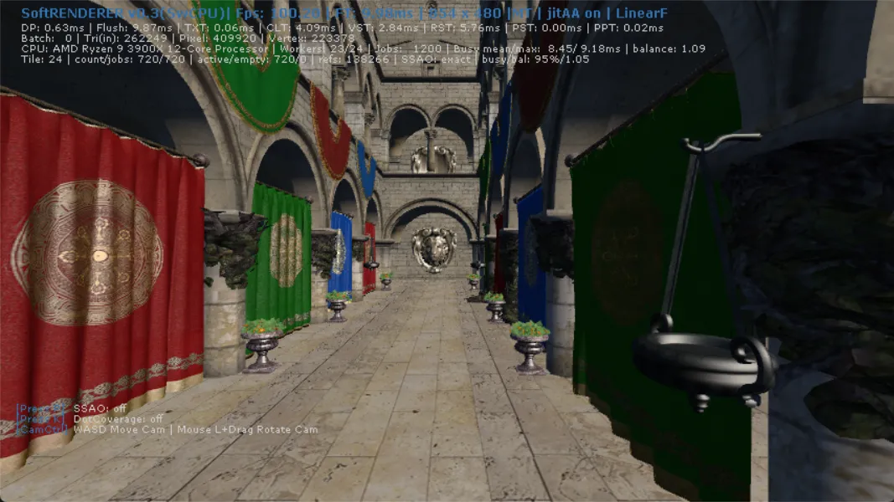

SoftRenderer 是我十多年前写的一款 CPU 软件渲染器。

最近我重新打开这个项目，和 Codex 一起做了几次连续重构。最后的结果很直接：仓库里保留的一组 854×480 Sponza 对照画面，从约 48.03 FPS / 20.82 ms 变成了 100.20 FPS / 9.98 ms。

不是换了 GPU。这个项目根本不用 GPU 画三角形。

真正改变的是 CPU 怎么分工、怎么等待，以及一帧里的数据到底归谁写。

优化前：


优化后：



这两张图很适合做标题，但它们还不能解释发生了什么。

如果只说“我加了 Tiled Renderer，所以快了一倍”，其实会漏掉这次重构里最有意思的部分：tile 只是新的所有权边界。真正的收益来自它顺手拆掉了一串旧流水线里的全局同步、共享写、全屏扫描、临时任务分配和主线程等待。

## 一个从 2015 年睡到现在的项目

SoftRenderer 的 Git 历史从 2015 年 4 月开始。当前这条开发线在 2018 年之后基本停住，直到 2026 年 7 月 17 日才重新出现提交。

它是一款很典型的早期个人渲染器：顶点变换、裁剪、光栅化、GBuffer、Pixel Shader、SSAO、JitAA 都由 CPU 完成；为了利用多核，我当年也做了一个 task dispatcher，把不同阶段拆成小任务扔给 worker。

这套东西不是完全没有并行。问题恰恰是，它看起来已经“多线程”了。

只看线程数量，很容易以为 CPU 已经吃满。实际往下追，会发现一帧默认最多经历五轮全池唤醒和等待：

```text
Clear
  → 等全部 worker
Vertex Shader
  → 等全部 worker
Raster
  → 等全部 worker
Pixel Shader
  → 等全部 worker
JitAA / DotCoverage
  → 再等全部 worker
```

每一轮里，快线程完成任务后只能等最慢的那个。下一阶段必须等上一阶段整批结束，哪怕它真正依赖的只是屏幕的一小块数据。

更麻烦的是，旧任务按三角形而不是屏幕区域切分。不同 worker 可能同时覆盖同一个像素，争夺 depth 和 fragment。Raster 完成以后，主线程还会逐像素扫描整张 zBuffer，先找出有效像素，再创建 Pixel Shader task。

854×480 只有 409,920 个像素，听上去不算大。但每帧完整扫描一次、为小块 vertex 和 pixel 不断 `new/delete` task、通过同一把锁领取任务，再让整个线程池反复睡眠和唤醒，累积起来就不再便宜。

线程确实都在，但很多时候它们只是在更有秩序地等。

## 我想做的不是“每个 Tile 重跑一遍场景”

Tiled Renderer 是我很早就想给这个项目补上的架构，但真正动手时，第一件事反而是缩小这个词的含义。

这里实现的是一条 **tile-binned CPU rendering pipeline**，更接近 sort-middle：

```text
Draw packets
  → VS / Clip / Triangle Setup
  → 把屏幕空间三角形分发到 Tile bins
  → 每个 Tile 独占 Clear / Raster / Local PS / Post
  → Frame Join
```

不是让每个 tile 从原始模型开始，重新跑一遍完整 Vertex Shader。

三角形属于哪些 tile，必须在 VS、裁剪、透视除法和屏幕映射以后才知道。如果每个 tile 都遍历全场景，跨 tile 的几何会被反复变换和 setup，减少同步的代价可能是把几何工作放大几十甚至几百倍。

所以新的几何前端仍然只准备一次三角形。之后通过一个确定性的两遍 CSR binner 完成分发：

1. 第一遍计算每个三角形的屏幕包围盒，并统计它覆盖哪些 tile；
2. 做 prefix sum，得到每个 tile 在连续引用数组里的区间；
3. 第二遍把 triangle reference 写入对应区间。

当前默认 tile 是 24×24。854×480 的画面会得到 720 个 tile，数量远多于 13 或 23 个 worker，足够让线程动态领取。

这一步很重要：tile 不固定绑定 CPU core。中心区域三角形多、overdraw 高，会比天空或角落更重。如果静态分区，某个核心守着重 tile，其他核心做完以后还是要在帧尾等它。现在 worker 通过一个原子 cursor 继续领取下一个 tile，快线程可以自然接手剩余工作。

## Tile 真正提供的是所有权

每个 tile 在执行期间只有一个 owner。

这个简单约束解决了旧实现里几件很难靠“小修”解决的事：

- 同一个像素不会被多个 Raster task 同时写；
- tile 可以独立清理自己的 color、depth 和 fragment；
- Raster 结束后直接遍历 tile 内的 winner，不再由主线程扫描整张 zBuffer；
- Local Pixel Shader 可以紧跟在本 tile 的 Raster 后执行；
- JitAA 等逐像素后处理可以在依赖允许时一起融合；
- 每个 worker 的 scratch、统计和 tile 数据可以帧间复用。

换句话说，Tiled Renderer 并不只是把二维画面切成小格子。它把“谁能写这块内存、什么时候这块数据算完成”变成了结构本身的一部分。

以前这些规则藏在 task 顺序、全局 barrier 和“大家应该已经写完了”的假设里。现在它们由 tile ownership 直接保证。

代码主体在 [`SrTileRenderer.cpp`](https://github.com/gameKnife/SoftRenderer/blob/59f2ac95fa81cce2fa0d089346595c413e9c02aa/code/SrSwRendererCpu/SrTileRenderer.cpp)，完整设计和性能 Gate 记录在 [`tile-binning-renderer-design.md`](https://github.com/gameKnife/SoftRenderer/blob/59f2ac95fa81cce2fa0d089346595c413e9c02aa/doc/tile-binning-renderer-design.md)。

## 有些 Barrier 不能为了好看硬删

这个架构并没有消灭所有同步。

SoftRenderer 的 `default_normal` shader 内嵌了 SSAO。它会读取当前像素周围的 GBuffer，而相邻像素可能属于另一个尚未完成的 tile。

如果本 tile Raster 完就立刻执行 SSAO，读取到的可能是上一帧数据，也可能是尚未写完的数据。这种情况下，“无 barrier”不是优化，而是错。

因此现在有两条路径：

- 普通 Local Shader 在 tile 内完成 Raster 和 shading，不需要独立的 Raster → PS 全局等待；
- 会读取完整 GBuffer 的 SSAO 走 deferred tile batch，等所有 tile 的 GBuffer ready 后再执行。

项目还保留了一个显式的 `--relaxed-ssao` 实验选项。它允许跳过尚未 ready 的邻 tile，从而删掉这次全局 barrier，但颜色结果会随调度变化。默认 exact 路径没有采用这个取巧版本。

这也是这次重构里我很想保留的一条经验：同步不是越少越现代。先把真正的数据依赖写出来，才能知道哪些等待是历史包袱，哪些等待是在维护正确性。

## 第一个 Tile 版本还没有快一倍

2026 年 7 月 18 日的 [`2ecdb31`](https://github.com/gameKnife/SoftRenderer/commit/2ecdb31a869de1780e0afff77c339a38490ee799) 第一次把整条 tile-binned pipeline 接通。

它已经通过了预先设定的性能 Gate，但还没有达到最后截图里的 100 FPS。设计记录中的首轮 Release 数据是：

- Sponza、SSAO on：Flush median 改善 24.7%，p95 改善 26.2%；
- SSAO off：改善约 34%；
- 小 Model：改善约 5.6%。

这个结果反而很有用。它说明 tile 架构确实解决了主场景的问题，但“换一种分块方式”本身并不会自动把所有额外开销一起清空。

后面的几个提交继续追 profiler：

- [`0743e85`](https://github.com/gameKnife/SoftRenderer/commit/0743e8564d550c22122f9c64fc7f594beaa63b38) 把逐三角形的 profiling 更新移出热路径；
- [`a0f856f`](https://github.com/gameKnife/SoftRenderer/commit/a0f856fea40084c492ccf71589b6fa729d2154df) 引入 worker-only batch 和独立的 renderer coordinator；
- geometry 输出、prepared triangle、bin count、offset 和 deferred winner 等存储开始帧间复用；
- BinCount 顺手完成 triangle bounds，减少重复遍历；
- deferred shading 只遍历 winner 地址；
- 没有跨屏依赖时，temporal post 与 tile 工作融合；
- primitive 和帧 VB 描述符不再为每个 subset 每帧重复分配和释放。

这里有一个挺反直觉的变化：主线程不再参与 tile batch。

旧思路会认为“多一个线程干活总是更快”，所以主线程也进入任务池。但主线程还有场景提交、帧交接和 present 要处理。新实现让 renderer coordinator 负责一帧渲染，worker 专心领取 tile；主线程完成前后帧数据的 hand-off，不再和 worker 抢同一批任务。

少一个参与 Raster 的线程，最后反而减少了更多等待。

## 然后我把 DirectX 从主路径里拿掉了

性能稳定以后，另一个历史问题变得很明显：这明明是一款 CPU renderer，窗口、输入和 framebuffer present 却把它绑在旧 Windows 路径上。

这轮重开先用 [`e533e11`](https://github.com/gameKnife/SoftRenderer/commit/e533e11c4169d002d3bc0eb44d8cd0450bf47e83) 和 [`dbc6527`](https://github.com/gameKnife/SoftRenderer/commit/dbc65277886484bb7726a6457732343c6bd61453) 把构建迁到 CMake，删除旧 `.sln`、`.vcxproj` 和 props，先得到一条可重复的构建基线。

随后 [`0ad793a`](https://github.com/gameKnife/SoftRenderer/commit/0ad793ae4d0b223a8da46dfc030fcc87ab5aed0e) 用轻量的 MiniFB 接管窗口、framebuffer present、键盘和鼠标：

- 删除 DirectDraw presenter；
- 删除旧的 Windows Keyboard / Mouse 封装；
- 平台线程、事件、动态库和路径行为收口到一层很薄的兼容接口；
- macOS、Windows、Linux/Wayland 使用同一份 CMake 工程；
- `.dylib`、`.dll`、`.so` 和自定义 `.swsl` shader 输出到同一套运行目录。

MiniFB 没有让 Rasterizer 变快。它解决的是另一件事：渲染核心终于不再需要为了显示一张 CPU framebuffer 而携带整套旧 DirectX 外壳。

后面又补了 WSL、MSVC aggregate initialization 和编译 warning。现在 macOS 可以直接：

```sh
./buildrun.sh
```

Windows 使用 `buildrun.bat`，Linux 默认走 Wayland，也可以切到 X11/OpenGL backend。

## M3 Max 上，当前版本到底有多快

为了避免只拿两张旧截图说故事，我在 2026 年 7 月 28 日重新构建当前提交 `59f2ac9`，先跑过 CTest，再在 Apple M3 Max 上做了一次 headless A/B。

配置是：

```text
Apple M3 Max / 14 CPU cores / 36 GB
macOS 26.5.2 / Apple Clang 21 / CMake Release
Sponza / 854×480
MT / JitAA / Linear Filtering / SSAO off
Tile size 24×24
每组 360 帧，丢弃前 120 帧，统计后 240 帧
```

结果：

| 后端 | Flush median | Flush p95 | `1000 / median` |
|---|---:|---:|---:|
| Legacy | 8.642 ms | 9.006 ms | 115.71 |
| Tile | 4.452 ms | 4.724 ms | 224.61 |

Tile 的 Flush median 降低了 48.5%，按 Flush median 推导的渲染吞吐是 Legacy 的 1.94 倍。

更让我在意的是利用率：

```text
720 tile jobs
13 active workers
tile-stage busy ratio median: 96.2%
tile-stage worker max/mean: 1.032
```

这说明在 tile 阶段，worker 大部分时间确实在做事，而且最忙线程与平均线程已经很接近。它比“系统里创建了 13 个 worker”更能说明多核有没有被真正利用。

当前 Apple Silicon 构建没有开启项目里的 x86 专属 `SR_USE_SIMD` 宏。编译器仍可能自动向量化，但这组结果至少说明：即使不依赖原来的 x86 SIMD 开关，只把数据所有权和调度关系理顺，M3 Max 也能把这条 CPU 流水线跑到很高的效率。

这里的 224.61 不是完整应用 FPS，而是 `1000 / Flush median`。它不包含完整的场景更新、窗口事件和显示开销，也只对应这个分辨率、场景与功能组合。换成更高分辨率、打开 SSAO、改用小模型或者换一台 CPU，比例都会变化。

复现入口已经进了项目：

```sh
./bin/SoftRenderer \
  --tile \
  --headless \
  --frames=360 \
  --width=854 \
  --height=480 \
  --scene=sponza \
  --no-ssao \
  --hash-output=tile.csv
```

换成 `--legacy` 就能得到同机旧后端对照。CSV 会同时记录 color/depth/GBuffer/winner hash、各阶段时间、tile 数、bin references、worker busy ratio 和负载平衡。

## Codex 在这里做了什么

这次合作不是“一句话让 AI 优化十年前的渲染器”。

旧项目最危险的地方不是代码写不出来，而是很多行为只存在于调用顺序里。编译通过，不代表 tile 边界没有裂缝；画面看起来差不多，不代表 equal-depth winner、SSAO 邻域读取和 JitAA 帧序列仍然一致。

我和 Codex 的合作方式更接近一次有验收条件的重构：

1. 先审计旧流水线，列出五轮全局等待、共享写和串行扫描；
2. 明确首版不做什么，例如不让每个 tile 重跑全部 VS；
3. 给正确性、性能、回退和统计先写 Gate；
4. 保留 `--legacy`，让新旧后端可以同机 A/B；
5. 增加 headless、fixed frames、hash CSV 和 tile layout tests；
6. 接通以后继续根据 profiler 找非架构性的剩余开销。

Codex 很适合做这种跨多个文件的审计、机械迁移和验证工具补全。我的工作仍然是决定：哪些语义必须保留，哪些 barrier 可以删，什么结果才算完成，以及某个更快但调度相关的 SSAO 版本能不能成为默认路径。

AI 没有替我绕过工程判断。它让我终于有能力把十多年前一直欠着的那轮判断完整做完。

## 最后

重开 SoftRenderer 之前，我以为这次大概只是把旧项目重新编译起来。

两天之后，它不仅有了我很早就想做的 Tiled Renderer，还摆脱了旧 Visual Studio 工程和 DirectX 展示层，可以在 Windows、Linux 和 macOS 上沿着同一套构建路径运行。

帧率接近翻倍当然很爽。但这次真正留下来的结论不是“tile 一定比传统流水线快”。

更准确的说法是：

> 当工作已经被拆成很多线程，下一步往往不是继续增加 task，而是重新定义数据的所有权，减少那些为了旧阶段边界而存在的等待。

十多年前我知道自己想做 tiled renderer，但一直没有把它写完。现在有了 code agent、可执行的 benchmark 和足够明确的工程边界，这个坑终于填上了。

源码：https://github.com/gameKnife/SoftRenderer
