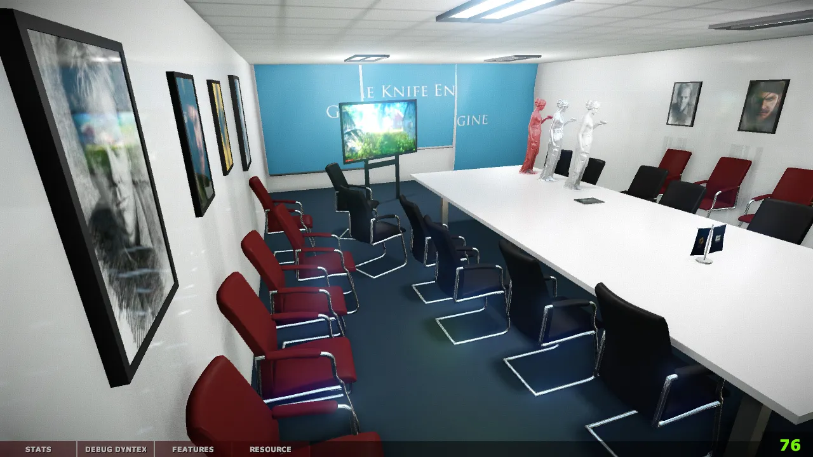

前几天，我刚把沉睡多年的 SoftRenderer 重新拉起来，补上 Tiled Renderer，最后把渲染吞吐做到了接近两倍。

差不多同一时间，我又打开了另一个更大的旧项目：gkEngine。

这次没有“帧率翻倍”那么干脆的结果。gkEngine 给我的第一课更朴素：

> 一个老引擎能不能重新运行，代码可能只占一半；另一半是它周围那套已经被时间拆散的工具链。

源码能编译，不代表资源已经生成；资源在磁盘上，不代表启动配置能找到它；窗口出现了，不代表运行的是刚刚构建的那份程序；场景终于加载，也不代表十年前的 shader、纹理压缩和坐标约定在今天看起来仍然正确。

所以这次我和 Codex 做的不是一次“升级到现代引擎”的大重构。

我们先把一条能从空环境走到 `conf_room` 室内场景的路径重新接通，然后沿着真正跑出来的画面，一层层修那些过去被工具和环境掩盖的问题。

这是一张 gkEngine 的历史室内截图：



我想恢复的不是一张截图，而是产生这张截图的整套过程。

## Git 仓库停了八年，引擎周围的世界没有

gkEngine 的公开 Git 历史最早可以追到 2013 年。它更早的开发经历还包括 DX9、OpenGL、GLES、多平台、延迟光照、资源编译器和 3ds Max 工具。

当前 master 的上一次提交停在 2018 年 10 月 20 日。下一次提交已经是 2026 年 7 月 17 日。

八年时间足够让很多“当年默认成立”的条件消失：

- Visual Studio 和 CMake 的默认行为变了；
- 旧 DirectX SDK 不再是新系统的常规组成部分；
- 32 位工具与 64 位引擎需要不同的 runtime；
- submodule、媒体包和资源转换脚本不再能假设当前工作目录；
- multi-config generator 会把不同配置的产物放到不同位置；
- 一个旧 `.bat` 即使没有语法错误，也可能悄悄操作了错误的目录。

更麻烦的是，这些问题通常不会一起报错。

你可能先得到一个缺 DLL 的 `texconv.exe`。补完 DLL，资源转换继续了，但具体 TestCase 没有进 target。修完 CMake，launcher 可以打开，却加载不到媒体包。最后终于编译成功，双击的又可能是 `build-win64\RelWithDebInfo` 里遗留的旧程序，而新 DLL 实际已经输出到 `exec\bin64`。

每一层都“差一点能用”。这些差一点叠在一起，就是一个八年后无法启动的工程。

## 重新运行不应该靠我记得八年前怎么操作

这轮第一个关键提交是 [`a5e0730`](https://github.com/gameKnife/gkEngine/commit/a5e0730f21f30aea730836feb710654cba46b90f)。

它没有发明新 renderer，主要工作是把 Windows 启动路径重新写成三个有明确职责的入口：

```bat
.\auto_make_env.bat
.\auto_cmake.bat
.\auto_buildrun.bat
```

第一步准备环境：

- 初始化 thirdparty、base media 和 `conf_room` 三个 submodule；
- 部署 DirectX 与 MSVC runtime；
- 解包媒体包；
- 执行 TGA→DDS、OBJ→GMF 等历史资源转换；
- 生成启动配置。

第二步只负责 CMake：

```text
source: gkEngine 根目录
build:  build-win64
arch:   x64
```

第三步构建 `RelWithDebInfo`，检查真正的输出文件，然后从 `exec\bin64` 启动 `gkLauncher.exe`。

把这些写出来，看起来只是脚本卫生。但对一个老项目来说，“从任意当前目录运行”“错误立即退出”“验证最终产物存在”比再多一页环境说明更有用。

因为我的记忆不是构建系统的一部分。

## 第一个坑：64 位引擎依赖一个 32 位工具

gkEngine 的 Windows runtime 现在构建为 x64，但资源管线里还保留着旧的 `texconv.exe`。这个工具是 32 位的。

如果只把 x64 的 D3DX 和 MSVC runtime 放到引擎输出目录，launcher 也许能启动，`texconv.exe` 却会在资源准备阶段直接失败。文件名看上去甚至都一样，真正不同的是位数。

新的环境脚本明确给 `texconv.exe` 部署：

```text
x86 d3dx9_43.dll
x86 D3DCompiler_43.dll
x86 msvcp100.dll
x86 msvcr100.dll
```

同时，D3D9 renderer 构建完成后会把对应的 x64 D3DX runtime 复制到自己的输出目录。

这是很典型的遗留工程问题：整个项目已经切到 64 位，不代表工具链里的每一个可执行文件都跟着切了。把“项目架构”当成“所有进程的架构”，只会得到一串很难读的启动失败。

## 第二个坑：CMake 成功了，但你运行的不是它刚构建的程序

旧 CMake 只配置了 `Release` 和 `Debug` 的输出目录。

新的构建脚本使用 `RelWithDebInfo`。对于 Visual Studio 这样的 multi-config generator，如果这个配置没有显式指定输出位置，部分产物就可能留在 build tree，另一部分 DLL 仍在 `exec\bin64`。

表面上编译成功，运行时却有两套互相不完整的结果。

这次把 `Release`、`Debug`、`MinSizeRel`、`RelWithDebInfo` 的 library 和 runtime 统一输出到 `exec\bin64`。`auto_buildrun.bat` 也不再从 build 目录猜 executable，而是明确检查：

```text
exec\bin64\gkLauncher.exe
```

这个改动没有技术炫技，但它消灭了一类最浪费时间的幻觉：我明明改了代码，为什么画面完全没变？

答案有时不是代码没生效，只是你一直在运行昨天的 exe。

## 第三个坑：TestCases 编译了，但具体 TestCase 没编译

原来的 CMake target 只列了：

```text
TestCaseFramework.cpp
```

框架确实存在，具体场景的 `.cpp` 却没有进入 target。新的配置会收集 TestCases 目录里的实现文件，`TestCase_InDoorRendering` 才真正进入构建结果。

随后 `startup.cfg` 增加了：

```ini
[launcher]
gamedll = TestCases
testcase = TestCase_InDoorRendering
```

引擎启动后不再停在菜单等待手工选择，而是直接进入 `conf_room.gks`。

这对复活旧工程非常重要。

如果每次验证都要先找到某个菜单、按几次方向键、再凭记忆走到同一个位置，那么不同构建之间的画面对比就没有稳定起点。能自动进入固定场景，才有资格继续谈 shader 和材质是否正确。

## 场景跑起来以后，真正的错误才开始出现

到这里，我们只是恢复了观察问题的能力。

接下来的几次提交开始处理画面本身。

### Color Grading LUT 不应该被 DXT 压缩

gkEngine 在找不到目标 DDS 时，会调用 `texconv` 从 TGA 自动生成。旧路径统一使用 DXT5。

这对普通颜色纹理可能是合理的默认选择，但 Color Grading chart 不是一张“看起来差不多就行”的图片。它是一份查表数据。DXT block compression 引入的颜色误差，会直接进入后续映射。

[`325e932`](https://github.com/gameKnife/gkEngine/commit/325e93284d6eedb8b97d68a06ee39fb731922d0d) 没有粗暴地取消所有压缩，而是区分路径：

- 普通媒体纹理继续使用 DXT5；
- `engine/assets/textures` 下的 data texture 使用 `A8R8G8B8`。

这个边界很重要。修复 LUT，不等于整个项目从此拒绝纹理压缩。

### 窗口是 1080p，Back Buffer 也必须真的是 1080p

[`9275db2`](https://github.com/gameKnife/gkEngine/commit/9275db25befa0cd5f166e23bdde895ffe21fad1e) 把默认尺寸改到 1920×1080，同时修了一个更隐蔽的问题：native window 创建时使用的成员变量没有先同步 `ISystemInitInfo` 里的请求尺寸。

结果可能是配置写着一套尺寸，窗口和 D3D device 各自相信另一套尺寸。

现在 window、startup config 和 back buffer 使用同一个请求值。1080p 本身不是什么新能力，真正的修复是让三处状态不再分叉。

### 固定相机不是方便截图，而是建立视觉回归坐标

[`b7e9f8b`](https://github.com/gameKnife/gkEngine/commit/b7e9f8b59bf5638e1ca0718d468e2311b29f28ff) 让 TestCase 可以声明对应的 `.cam` 文件。室内场景绑定 `conf_room.cam`，运行时通过 Ctrl+数字切换 camera record。

以前我可以自由移动镜头，但这不适合判断反射、SSRL 或 Color Grading 的细微变化。相机位置稍微不同，画面的高光、遮挡和环境反射就会一起变化。

固定场景解决“每次进入哪里”，固定相机解决“每次看向哪里”。

它还不是完整的 image regression，但至少让同一个问题可以从同一个位置反复观察。

### 旧 Shader 里的轴约定真的会错

gkEngine 使用 Z-up 坐标，部分环境贴图路径又会做 `xzy` 轴变换。

在 2D environment reflection 路径里，反射向量的计算与 cube map 使用的约定没有完全对齐。[`9550f3a`](https://github.com/gameKnife/gkEngine/commit/9550f3a1f76df08c0c614eb79e382002ec7a252a) 把 normal 和 view 统一到 XZY world-axis convention 后再计算 reflection vector。

这不是“让效果更现代”，只是让同一份世界方向在两条环境反射路径里表达一致。

SSRL 的改动需要更谨慎地描述。[`042d3bd`](https://github.com/gameKnife/gkEngine/commit/042d3bdd093ed58b8e4a762dff27e7345a68800a) 把 edge mip shaping 从连续平方改成连续开方，并把环境贡献从 `0.2` 调到 `0.25`。这里既有对旧曲线的修正，也有重新看过画面后的参数调整，我不会把它包装成一个有唯一答案的数学 bug。

另外，[`9dd8de1`](https://github.com/gameKnife/gkEngine/commit/9dd8de12176f9c93af6bb0d34f42b2e43af2ab91) 会把默认 linear min/mag sampling 提升为 anisotropic，同时尊重设备的 `MaxAnisotropy`，point sampler 保持原样。

这些修改都不大。只有完整场景、材质和相机重新接通以后，它们才从十年前的代码里重新显形。

## 新工具链不只负责把旧程序打开

这次还增加了一个和启动引擎方向相反的工具：[`gks2glb.py`](https://github.com/gameKnife/gkEngine/blob/9550f3a1f76df08c0c614eb79e382002ec7a252a/exec/tools/gks2glb.py)。

它不加载 renderer，而是直接读取 gkEngine 的数据：

```text
GKS scene
  + OBJ mesh
  + XML material
  + TGA texture
  + CAM records
  → self-contained GLB
```

导出器会保留 node hierarchy 和 transform，把 Z-up 转成 glTF 的 Y-up，将 TGA 转成 PNG 后嵌入 GLB，把 point light 写成 `KHR_lights_punctual`，并把同名 `.cam` 里的相机记录导出成 glTF camera node。

它只依赖 Python 标准库，也不要求 D3D9 或 Windows runtime。

```bat
python exec\tools\gks2glb.py ^
  exec\media\level\conf_room\conf_room.gks ^
  build-win64\conf_room.glb
```

当前支持范围仍然很窄：sample level 使用的 OBJ 和 XML `.mtl`，不是 gkEngine 所有历史资产格式。

但这条路径的意义不在“我们也支持 glTF”。

它给旧资产增加了一个不依赖旧 renderer 的观察出口。即使某个平台上的 runtime 暂时还没有恢复，我也能检查场景层级、坐标、相机、灯光和材质引用；未来要迁移到 Blender、其他 viewer 或 gkNextEngine，也不必先把整个旧引擎嵌进去。

能把旧数据带出来，本身就是工具链复活的一部分。

## Codex 在这种工程考古里真正有用的地方

这轮工作同样不是“一句话让 AI 修好一个十五年前的引擎”。

Codex 最有价值的地方，是可以沿着一个失败继续向外追：

```text
launcher 没起来
  → executable 在哪里
  → DLL 是谁复制的
  → 为什么 texconv 先失败
  → 它是 32 位还是 64 位
  → media pack 是否解开
  → TestCase 有没有进 target
  → startup.cfg 最后选择了谁
```

人维护老项目时，很容易被熟悉感欺骗。“这套脚本我以前用过”，会让我下意识跳过最应该检查的地方。Codex 不拥有这份肌肉记忆，反而会把路径、位数、工作目录和返回码一项项展开。

另一方面，AI 也很容易把“能编译”当成完成。

所以这次仍然需要我给它明确边界：

- 目标不是先重写 D3D9 renderer，而是恢复一个固定室内场景；
- 不能为了省事把所有 data texture 都改成无压缩；
- 坐标变换必须同时核对 engine、camera 和 glTF 的轴约定；
- SSRL 的视觉参数不能伪装成普遍正确的公式；
- 新 exporter 必须承认自己只支持一部分资产。

Code agent 加快的是追踪、修改和验证循环，不是替我决定怎样解释十多年前的设计。

## 我没有把 gkEngine “现代化”

这轮工作之后，gkEngine 仍然保留 D3D9、DXUT、旧 shader 系统、自有材质和历史资源编译器。

我没有把它改成 Vulkan，也没有把所有平台重新认证一遍。过去支持过 macOS、iOS、Android、GL3 和 GLES2，不代表 2026 年这些路径已经全部重新跑通。

当前明确恢复的是 Windows / D3D9 / `conf_room` 这条主路径，以及一个可以脱离 renderer 工作的 GKS→GLB 出口。

我觉得这样反而更诚实。

如果目的是写一款今天的现代个人引擎，我已经有 gkNextEngine。gkEngine 这次更像一份仍然可以运行的工程档案：保留它当年的选择，同时给它补上今天能够继续观察、构建和迁移的入口。

## 最后

SoftRenderer 的复活让我重新理解了多核调度。

gkEngine 的复活让我重新理解了“工程”这个词。

一款引擎从来不只是 renderer 和几组 C++ module。它还包括第三方库、资源编译器、媒体包、启动参数、测试场景、相机、脚本和那些当年没人觉得需要写下来的默认条件。

代码在 Git 里活了下来，不代表这些条件也活了下来。

这次我和 Codex 做的，是把其中一条完整路径重新变成可执行的事实：

```text
拉取依赖
  → 准备资源
  → 生成工程
  → 构建正确产物
  → 自动进入固定场景
  → 切换固定相机
  → 修正真实画面
  → 把旧场景导出到开放格式
```

十多年前，我更关心引擎还能增加什么功能。

现在重新打开它，我更关心的是：一个决定能不能被复现，一个资产能不能被带走，一个错误能不能从固定入口再次看见。

这可能不如“重写一款引擎”听起来激进，却是让旧工程真正重新获得生命的方式。

源码：https://github.com/gameKnife/gkEngine
