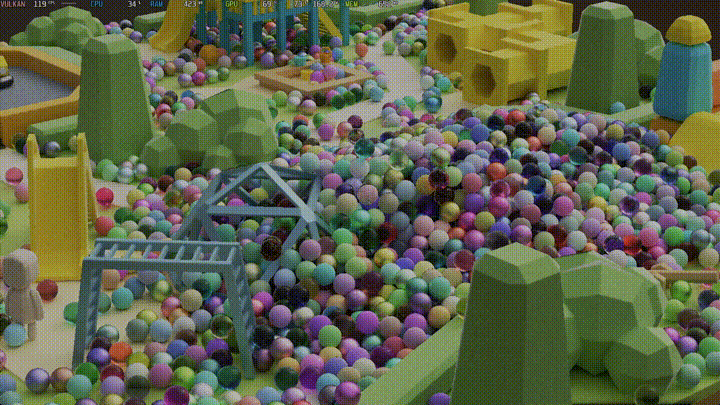

先看东西。



这个场景来自仓库里的 `RTIO.proc`。代码先生成一张 44×44 的候选网格，去掉中心附近的位置，最后留下约 1900 个球。它们共享一份球体网格，但各自有独立节点、材质和 Jolt 动态刚体。

我原本准备给这篇文章放一个更夸张的数字。真正动笔前重新翻源码、重跑 benchmark，发现旧稿里的“8192 个球 @1000fps”在当前仓库里没有可复现的场景和报告。

那就不用。宣传稿也应该服从和代码一样的规矩：能重现，再写。

2026 年 7 月 15 日，我在这台机器上重新跑了一次：

| 项目 | 结果 |
|---|---|
| GPU | Apple M3 Max |
| 驱动 | MoltenVK 0.2.2209 |
| 管线 | SoftwareModernNoAmbient |
| 分辨率 | 1920×1080 |
| 平均帧时间 | 8.489 ms |
| 平均 GPU 时间 | 3.499 ms |
| 平均帧率 | 117.80 FPS |

它没有 1000fps 那么适合做标题，但足够说明我真正想讲的东西：场景里有近两千个独立对象，几何提交仍然可以收敛到固定的几次调用。

## 一、2014 年，我被几千个 Quad 打败了

先讲当年的耻辱。

2014 年我做过一个迷宫场景，几千个 Quad 就卡到不能玩。当时我一直在优化状态切换、合并纹理、排序 draw call，效果很有限。

后来才明白，问题不一定是 GPU 画不动，而是 CPU 派活儿的方式不对。

传统 CPU-driven 路径里，一个对象通常对应一段 CPU 侧提交工作：选择材质、更新资源、录制 draw。对象一多，驱动调用和状态管理先把 CPU 填满，GPU 反而在等。

这是我今天仍然保留这个球场景的原因。它不是为了证明一台 2026 年的电脑会画球，而是为了检查引擎有没有重新掉回“对象数量约等于提交数量”的旧路径。

## 二、GPU-Driven 改的是谁来决定画什么

GPU-Driven 的核心并不神秘：CPU 把候选对象和场景数据交给 GPU，compute shader 做剔除和压实，再由 indirect draw 消费结果。

这样以后，CPU 侧的几何提交次数不再随对象数线性增长。注意，我说的是“几何提交次数”，不是“整个 CPU 成本恒定”。节点更新、物理模拟、资源上传和 GPU 上的剔除工作仍然会随场景规模变化。

这套结构和前面讲的全 Bindless 很搭。GPU 要自己决定画谁，就必须能直接访问节点、材质、顶点、索引和统计数据。它们都从 128 字节的 `GPUScene` 根结构可达；纹理则用全局数组索引。要是每个球仍然等 CPU 来绑定材质，GPU-driven 只完成了一半。

## 三、我的 Soft Mesh 路径

引擎当前没有把 mesh shader 设成必需能力。我用 compute + vertex shader 做了一条 Soft Mesh 路径。

compute 阶段先剔除不可见对象，把可见几何压实到编码流和间接绘制参数里。后面的 visibility pass 再从这份结果取数据。不可见对象不会在 CPU 侧留下同等数量的提交调用。

当前主视图的 visibility pass 调一次 `vkCmdDrawIndirect`，四级 CSM 的每个 cascade 再各调一次。一帧的这条几何路径合计五次 Vulkan draw 调用：

```text
GPU cull / compact
        ↓
main visibility      vkCmdDrawIndirect × 1
sun shadow cascade   vkCmdDrawIndirect × 4
```

这里也要把口径说清楚。“五次”指主几何加四级太阳阴影的提交，不是整帧只有五条 Vulkan 命令，更不是 profiler 里的统计项都应该显示 5。后处理、UI、调试绘制和其他 compute pass 当然还在。

这条软件路径对我最重要的价值也不是宣称它比硬件 mesh shader 快。没有同场景、同实现的 A/B benchmark，这种结论没有依据。它的价值是可控：数据格式、剔除策略和平台 fallback 都由引擎自己决定，桌面和移动端可以共用主要结构。

## 四、约 1900 个“独立”到底独立在哪里

这个场景没有为每个球复制网格。共享几何本来就是引擎应该做的事。

独立的是运行时身份：每个球有自己的 node、material 和 physics body。材质从 Lambert、Metallic、Dielectric 中随机生成参数，Jolt 负责动态刚体和碰撞，渲染器每帧读取节点变换。

因此它既不是把一个静态 mesh 烤成大模型，也不是一个变换矩阵数组就结束的纯展示 instancing。另一方面，Jolt 会正常执行休眠等策略，所以也不能把这组结果解读成“1900 个刚体永远全速活跃”。

物理与渲染的接口很薄：物理更新节点变换，GPUScene 暴露节点表，渲染读取。对象多了以后，物理和数据更新仍然要付成本；固定下来的是渲染提交的形状。

## 五、117.80 FPS 的意义

这个数字只描述一组明确条件：M3 Max、MoltenVK、1080p、SoftwareModernNoAmbient，以及当前的 `RTIO.proc`。

它不能直接外推到 4K、路径追踪、手机 GPU，也不能证明 Soft Mesh 在所有硬件上都优于另一条实现。换分辨率、渲染路径、可见率、阴影设置，结果都会变。

我觉得它仍然有价值，因为读者可以拿到同一份代码、同一条命令和同一份 CSV 口径。数字不必惊人，可复现本身就是技术内容的一部分。

也顺手提醒我一件事：旧截图和旧记忆不能当 benchmark。项目一直在变，场景规模、默认 renderer、驱动和统计口径都会变。每次发布重新跑一次，比维护一个越来越神话的数字省心。

## 六、跑出你自己的结果

当前场景可以这样跑：

```bash
./gnb build gkNextMotionBenchmark
./gnb run gkNextMotionBenchmark \
  --load-scene RTIO.proc \
  --width 1920 --height 1080 \
  --hidden-window \
  --cvar "r.rendererType 4"
```

benchmark 会在构建目录的 `bin/` 下生成 `report_*.csv`。发布时我会一并保留这次报告，避免只剩一张看不到配置的 gif。

不同机器跑出不同结果很正常。比单独报一个 fps 更有意思的是一起记录 GPU、驱动、分辨率、renderer 和场景版本，这样数字才有比较价值。

下一篇换个话题：这套引擎是怎么被我和一组 AI agent 一起写出来的。不是“一句话生成游戏引擎”，而是怎么把仓库修成一条 agent 真能走完的路。

---

源码 / 链接

- gkNextEngine：https://github.com/gameknife/gkNextEngine
- 场景生成：`src/Application/Common/DemoScenes.cpp`
- GPU-Driven 主路径：`src/Engine/Rendering/VulkanBaseRenderer.GpuDriven.cpp`
- 四级阴影提交：`src/Engine/Rendering/Shadow/ShadowMapPass.cpp`
- 本次基准原始报告：`benchmark-rtio-2026-07-15.csv`
- 上一篇：[ImGui 官方 backend 很稳，我还是把它换掉了]（发布后回填链接）
