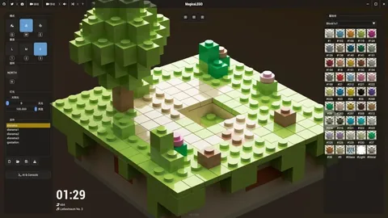

AI 生成 3D 内容这两年路线很多：直接吐 mesh 或体素的，NeRF 的，Gaussian Splatting 的。这些路线都很好，但是，它们解决的问题和我关心的不是一件事。

我关心的是：怎么生成一个**能进工程、还能继续改**的资产。

这里可以插播一个最新项目 NextWorldTravel 的工作流。

先简单介绍一下这个app的功能。用户可以说一句话，例如，生成一个苹果总部的小景观。生成一个香港旺角的小景观。就可以在20秒左右的时间内，得到一个和你描述一致且有丰富细节和信息的小景观diorama可供把玩。你还可以进一步的，要求agent来调整细节。

那么他的流程，主要就是通过生成，理解，修改一个纯代码描述的场景文件来实现的。最终的这个丰富细节的小景观，没有存储任何的mesh网格和纹理数据，只是一千来行代码。

这里放几张组合的动图。

<!-- TODO 配图未产出：NextWorldTravel 的组合动图，正文已经点名要放在这里。素材放进 src/assets/blog/ 后按  补上。 -->

这个要求听起来很低，其实很挑剔。生成得像不像，看一眼就知道；生成完能不能改，得等到三个月后策划说"这个门再宽半米"的时候才知道。绕了一圈之后，我越来越偏向一种看起来很古典的办法——让它写代码。

上一篇《15 年，推倒重写 gkEngine》里我塞了一段话，说 gkNextEngine 的场景、建筑、道具和角色现在都是 `.scad` 文本，配了两张图就翻过去了。这次把那一段展开，讲清楚这条路到底怎么走的、代价是什么、哪里走不通。

分两篇。上篇讲零件和地面，下篇讲程序化布局和角色动画，最后回到 NextDayz 看它们怎么合体。

---

## 一、为什么是 OpenSCAD，一门给 3D 打印用的老语言

这条路的起点其实比了解到 OpenSCAD 早，而且小得多。

MagicaLego 是我的赛博乐高子项目。想让模型帮玩家搭东西的时候，我没让它直接操作游戏状态，而是给它定义了一套很小的指令语言 mlscript：`place`、`move`、`turn`、`goto` 这些命令，加上变量和 `repeat` 循环，一个光标像 Turtle Graphics 那样在格子里爬。模型生成脚本，脚本先解析、校验，再交给游戏执行。

当时这么设计主要是图省心，不想让模型的输出直接碰运行时状态。但它意外暴露了一件更有用的事：**模型写这种有语法、有重复结构的指令，比让它直接吐一大串坐标靠谱得多。** 想想也不奇怪，代码和结构化文本本来就是它训练数据里最多的东西。



问题就在这儿：mlscript 只够搭积木。要描述任意几何，得有一门真正的 3D 语言。

于是就有了这一节的标题。先说一句可能让人失望的话：这门语言不是我发明的，也不新，甚至不先进。

OpenSCAD 在程序员圈子里小有名气：用代码描述实体几何，`cube`、`sphere`、`cylinder` 加上 CSG 布尔运算，参数改一个数字模型跟着变。3D 打印社区用了十几年。

看一眼就知道是什么东西了。这是 `kit_coldwar.scad` 里的弹药箱：

```scad
module cw_item_ammobox(seed = 0)
{
    color(cw_OLIVE())  translate([0, 0, 0.13]) cw_boxc([0.32, 0.16, 0.26]);
    color(cw_OLIVED()) translate([0, 0, 0.25]) cw_boxc([0.34, 0.18, 0.05]);
    color(cw_MARKW())  translate([0, -0.081, 0.12]) cw_boxc([0.18, 0.004, 0.07]);
    color(cw_METALD()) translate([0, 0, 0.29]) cw_boxc([0.1, 0.04, 0.03]);
}
```

四个盒子：箱体、箱盖、正面白漆标记、顶上的提手。没有 UV，没有贴图，颜色直接写在几何上。它在游戏里是一把可以捡的弹药箱。

程序化生成这条路当然不新。Houdini 那套节点图，加上它背后二十年的工业实践——城市生成、地形、破碎、植被——早就把"内容是一段可以重跑的程序"这件事证明完了。我做的事情，信念上和它是同一件。

区别在两点。一是入口：节点图对人友好，文本对模型友好，而我要的正是让模型来写。二是规模：Houdini 背后是一整支 TA 团队，我这边是一个人加几个 agent，所以整条链路必须窄到我自己能扛。

具体到选 OpenSCAD 而不是自己造一门 DSL，理由是三条。

**第一，模型本来就认识它。** 公开代码里有大量 `.scad` 示例，主流模型通常能给出一个语法正确的起点，不必只靠我的仓库现学。这和引擎选第三方库是一个逻辑：能用生态里已有的表达，就别自己造一个只有你懂的。

**第二，它天生参数化。** "把杯子加高一点"，对 mesh 是重新生成一遍，对 SCAD 是改一个数字。

**第三，它是文本。** 能 diff，能进版本管理，能局部修改，能写测试。

第三条是我一开始最不看重、后来觉得最重要的。资产不再是一个来历不明的二进制 blob，而是一段可以审的程序。

---

## 二、代价：确定性这部分，只能自己造

这条路不魔法的地方在于，引擎这边要先付一笔实现成本。模型写出来的 SCAD，总得有东西把它变成三角面。

这套东西现在是这样：自己的 lexer、递归下降 parser、AST evaluator，CSG 布尔交给 Manifold（真布尔，不是 hack），`text()` 字形走 FreeType，凹多边形和带洞轮廓用 Earcut 三角化。数据流是：

```
.scad + use/include 闭包
  → Lexer → Parser → AST → Evaluator
  → SCAD 空间三角汤 + user module 调用树 + RGBA 颜色桶
  → Z-up 转 Y-up、法线、材质、Model/Node 层级 → 上传 GPU
```

OpenSCAD 的语言面不是玩具级：`module` / `function` 定义、`for` / `if` / `let`、list comprehension、`linear_extrude` / `rotate_extrude`、`hull`、`$fn`，以及 `children()` / `$children` 这类进阶语义。

这笔账值不值，取决于你认为买到了什么。我认为买到的是**确定性**：同一版本可执行程序、同一设置、同一平台，同一段 SCAD 会沿同一条求值路径得到逐字节相同的结果。

这一条听起来平淡，但它是整条路线的地基。概率的部分全部收在模型那一侧，工程这一侧一点随机都不留——只有这样，"生成 → 校验 → 报错 → 修复"才是一个能转的回路，而不是每次都在赌。

顺带把边界说清楚：它实现的是 OpenSCAD 风格的子集，和官方 OpenSCAD Viewer 不完全兼容。

---

## 三、真正被复用的不是模型，是契约

单个模型跑通之后，第一个真问题不是几何，是复用。

一张 1 平方公里的地图不可能每栋房子单独写。需要的是零件库——有命名规范、有放置约定、能被机器检索的模块集合。这就是 kit。

现在 `assets/scad/lib/` 下有 12 个 kit 文件，其中 10 个进零件目录，共 **576 个模块**。NextDayz 用的 `kit_coldwar.scad` 是最大的一个，114 个模块。

但真正让这些零件能用的，不是零件本身，是下面这张表：

| 类别 | 契约 |
|---|---|
| 所有落地件 | 底面 z = 0 |
| 带朝向件（门面、取货面、开口） | front 朝 −y |
| 载具 | 车头朝 +x，底面 z = 0 |
| 武器 loot | 平躺地面、枪口朝 +x，厚度 0.05~0.08 |
| 桥 | 沿 x 跨越，锚点是引桥端路面高度 |

有了它，"把加油站摆在路北侧、门朝路"就是一句 `rotate([0, 0, 180])`，摆的人不需要打开模型看它朝哪。没有它，每摆一个零件都要先看一眼——576 次。

命名也是契约的一部分。模块名的第二段就是类别：`cw_bldg_barn` 属于 `bldg`，`cw_wpn_ak` 属于 `wpn`。这个约定土得掉渣，但它让"从名字推导分类"变成纯字符串操作，不需要额外的元数据文件，也就不会和源码漂移。

### 契约要能被求值，不能只写在文档里

契约写在注释里，三个月后就是废话。所以 `gnb scad catalog` 会把全库求值一遍，给每个模块生成一条记录：

```json
{
  "name": "ap_furn_bench_row",
  "category": "furn",
  "footprint": [2.32, 0.56],
  "height": 0.87,
  "zMin": 0.0,
  "triangles": 192,
  "warnings": 0,
  "ok": true
}
```

`footprint`、`zMin`、`triangles` 全部是真跑出来的，不是手填的。于是契约变成了可检查的东西：0 三角 = 空几何，footprint 异常大 = 有零件飞了，zMin 异常负 = 穿地（桥除外）。576 个模块里当前 573 个 ok，3 个的默认参数不产几何，catalog 自己标出来。

这份 JSON 后来还长出了两个我一开始没想到的用途：ScadLibrary 左侧的零件浏览器直接读它；下篇会讲的那个 spec 生成管线，喂给模型的"零件菜单"也是从它生成的——模型不需要读 1,875 行 kit 源码，只需要一份"模块名（参数）宽 × 深 高"的清单。

### 一个通病：倾斜杆件的符号

写这批 kit 的过程里，我发现模型在一类几何上会稳定犯同一个错。

凡是带收分的结构——水塔、瞭望塔、通信塔、A 字腿——出来的东西塔脚收成一点、塔顶张开，是个倒立的锥。不是偶尔错，是几乎每次都错。

原因不难找：两个轴的符号规则不对称。对一根居中的 Z 向杆件 `translate([px, py, h/2]) rotate([rx, ry, 0])`，顶端在 x 上的位移是 `+h/2·sin(ry)`，在 y 上却是 `−h/2·sin(rx)`，多一个负号。模型是按"对称"的直觉写的，两个轴用同一套符号，于是 x 方向对了 y 方向就反。正面看还挺像回事，转 90° 就穿帮。

正确的写法是 `rx` 与 `py` 同号、`ry` 与 `px` 反号。

我的处理不是逐个去改模型的输出，而是把这条连同推导一起写进 kit 作者手册，让它成为下一次生成时的约束；库里已经长歪的那批一次扫掉。配套还补了两条：横撑必须跟着腿收分（写死常量偏移的话，一半高度上横撑会脱开腿浮在空中），以及一句自检口诀——**塔类看侧影是不是上窄下宽，斜撑看它是不是"扶着"主体而不是"推开"主体**。

这个模式后来重复了很多次：发现一类系统性错误，把它压成一条可检查的规则写回手册或 prompt，而不是把每次的修补留在对话记录里。下篇讲 spec 生成时还会碰到。

<!-- TODO 配图未产出：img-scad-kit-showcase.webp（`coldwar_showcase.scad`：114 个模块按类别排开。它同时是验收场、选型目录和回归基准。）。补图放进 src/assets/blog/ 后改回 ` module 负责生成地形网格和半透明水面，两个纯函数 `gk_terrain_height` / `gk_terrain_info` 负责查高度、坡度、水域和生物群系。

### 一个地形就是一个数组

`TERR` 是纯数据。NextDayz 那张 1 平方公里地图的完整地形描述长这样（节选）：

```scad
TERR = ["gkterr1", [1000, 1000], [176, 176], 7, [0, 2.6, 0.5], undef, "temperate",
    [
        ["mountain", [-260, 380], 190, 52, 0.6],
        ["ridge",    [[-430, 310], [-180, 400], [60, 390], [270, 340]], 130, 24],
        ["lake",     [-330, -330], 55, 2.6],
        ["river",    [[-60, 470], [-30, 300], [-110, 160], [-60, 20], [20, -160], [30, -500]], 12, 2.4],
        ["road",     [[-500, -140], [-390, -110], ... , [500, -115]], 8],
        ["pad",      [-300, -174], [46, 32], 0]
    ]];
```

七类 feature：mountain、ridge、plateau、lake、river、road、pad。

**它们按书写顺序作用**，这个顺序本身就是语义：先山脊台地隆起，再河湖下切出水，再道路压平路面，最后 pad 压平建筑基座。换个顺序结果完全不同——先压路再隆山，路就跑到山坡上去了。

全部 seed 确定性。同一份 TERR 逐字节生成同一张网格，换台机器也一样。


### 一份三角化结果，喂三个消费端

这是我认为 SCAD Terrain 最值的一个设计。

地形三角化只做一次，同一份结果同时喂给渲染、碰撞和寻路。不是三份各自算出来的数据，是同一份。

所以"寻路以为能走、画面上其实是悬崖"这类事，在结构上不可能发生。做游戏最烦的一类 bug 就是"看起来是对的，逻辑上是错的"，而这类 bug 基本都来自同一件事被算了两遍。

<!-- TODO 配图未产出：img-scad-riverland-overview.webp（`riverland_1km.scad`：1 平方公里、176×176 格，一条东西向公路穿过河上的混凝土桥，八块 pad 压出据点基座。整张图是一个 416 行的文本文件。）。补图放进 src/assets/blog/ 后改回 ![`riverland_1km.scad`：1 平方公里、176×176 格，一条东西向公路穿过河上的混凝土桥，八块 pad 压出据点基座。整张图是一个 416 行的文本文件。](../../assets/blog/img-scad-riverland-overview.webp） -->

### 代价：不再是合法的 OpenSCAD

带 `gk_` 扩展的场景，原版 OpenSCAD 打不开了。

kit 零件、静物、角色文件仍然是合法 OpenSCAD，官方软件可以直接查看；但一旦引入地形，这个双向兼容就断了。地形必须和物理、寻路共享同一份数据，这件事纯语言层面做不到，所以我接受了这个结果。

但它确实是这条路线上第一处主动放弃的兼容性，不该被含糊过去。

---

## 五、小结

到这里，一个静态场景已经可以完全由文本描述：kit 提供零件，terrain 提供地面，两者都能进 git、能 diff、能被求值验证。

如果你要走类似的路，三条我觉得最贵的经验：

- **契约要早定、要全库统一。** 底面 z=0、front 朝 −y 这种约定看着无聊，但它决定了摆放那一侧能不能盲拼。改契约的成本随零件数量线性增长，576 个的时候改，和 20 个的时候改，完全是两件事。
- **契约要能被求值。** 写在文档里的约定会腐烂，能跑出 footprint 和 triangles 的约定才是回归基准。这也是后面让模型参与的前提。
- **确定性不能有例外。** 同一段 SCAD、同一份 TERR，逐字节生成同一份结果。这一条一旦破了，"生成 → 校验 → 修复"的回路就转不起来了。

下篇讲怎么让模型参与进来（spec、组合子和三层用法），以及怎么让文本描述的角色动起来（ScadRig 的 17 根骨骼和 31 段动作），最后回到 NextDayz，看这四件套怎么在一个 416 行的文件里合体。

最后想问一句：**如果你也在做程序化或者生成式的资产管线，你的"契约"是写在哪儿的？** 是文档、是代码里的 assert、还是干脆只在几个老人的脑子里。我这两年反复踩的坑基本都在这一层，很想看看别人是怎么处理的。

---

**源码 / 链接**

- gkNextEngine：https://github.com/gameknife/gkNextEngine
- 本篇相关代码：SCAD 工具链 `src/Modules/ScadLoader/`，零件库 `assets/scad/lib/`，NextDayz 地图 `assets/scad/proc/coldwar/riverland_1km.scad`
- 仓库内文档：`docs/AGENT_GUIDE/SCADLoader.md`、`docs/AGENT_GUIDE/ScadTerrain.md`、`docs/AGENT_GUIDE/ScadAssetPlaybook.md`
- 上一篇：[15 年，推倒重写 gkEngine](https://zhuanlan.zhihu.com/p/2042766137314784589)
