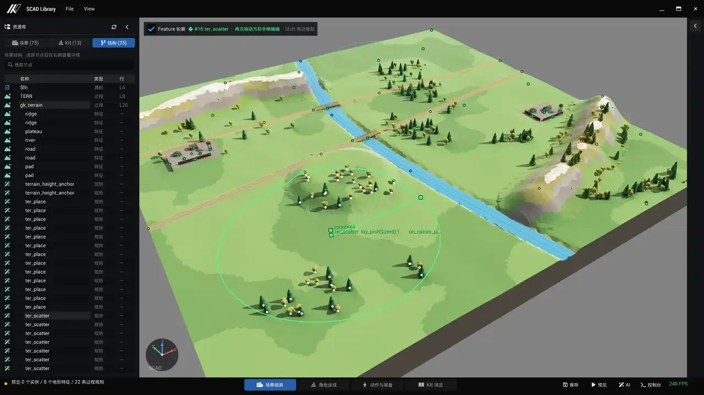
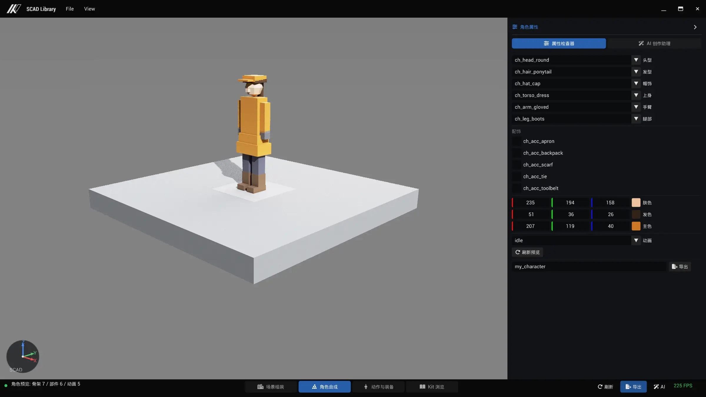
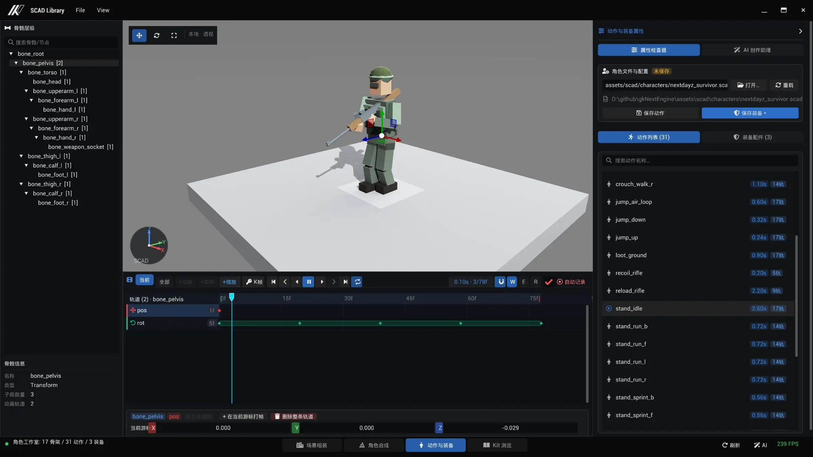

上篇讲了零件和地形：kit 提供一套有契约、能被求值检查的模块库，terrain 提供能走、能寻路、能碰撞的低模地形，两者都是纯文本。

这一篇我们从NextDayz的开发入手，讲用Scad开发游戏剩下的两件事：
- 怎么把零件按规则铺满一平方公里
- 怎么让文本描述的角色动起来

---

## 一、大规模场景构建

NextDayz是模拟Dayz的一个1km x 1km的游戏地图，接下来就是挑战：怎么把 1600 来棵树、几十辆弃车、八个据点摆到 1 平方公里的地形上？

最朴素的思路，让LLM根据自己的想象力，展平的方式在scad文件内用kit布置上万个位置。我尝试过，放弃了。一个是很耗token，一个是慢。

因此，这里借鉴了Procedural Genertation的思路，我们做一些“分布算子”，教给LLM，让他们来摆算子并设置参数。这些算子可以以非常小的节点数量，稳定控制大量生成，后续人工修改也更加方便。

### 分布算子模块

`kit_layout.scad` 和 `kit_terrain.scad` 是两个特殊的 kit——它们一个三角形都不产，只做放置：网格阵、直线阵、环阵、区域散布、沿折线撒点，以及同一批语义加上地形采样后的贴地版本。

关键在于每实例变量会穿透 `children()`：`$idx`、`$col` / `$row`、`$seed`、`$px` / `$py` 在子节点里都可读。这是 OpenSCAD 动态作用域给的能力，我在 loader 里专门验证过 `for` 体内的 `$var = ...` 赋值能穿透 `children()` 并补了测试。

「六个摊位围着水井排一圈、每个外观不同」就是一句 `lay_ring(6, 9, seed = 3) oc_bldg_stall(seed = $seed);`
「树只长在海拔 0.5 到 40 米、坡度不超过 26 度、离水 3 米以上的草地上」也是一行。

这里需要注意的是：散布可以交给算子，结构不要交给随机。植被、杂物、路灯用散布；房屋这类结构件老老实实手摆坐标。让随机去摆建筑，出来的东西永远差一口气——你说不出哪里不对，但它就是不像有人住过的地方。

### 规则要写进系统提示词

系统提示词里现在有 13 条硬规则，全部来自真实翻车。比如第 12 条：路过河必须配桥，桥长至少 2.5 倍河宽，并用 `snapAt` 设为岸上路面点。

它来自一次断桥事故。道路算子对填方超过 0.9 的深沟会自动留空，摆一座桥上去即可，但第一版的桥全是断的。河岸有一条下切带，宽度是半河宽的 2.2 倍；桥太短，引桥就落在下切带的斜坡里，下桥那一步的高差超过 NavGrid 的 `maxStepHeight`，桥两端在寻路图上直接断连。画面上桥好好地架着，逻辑上它不通。

### 文本的东西，也得能可视化编辑

都是文本，但调参靠改数字重新截图，效率很低。所以 ScadLibrary 里做了一个过程编辑页：打开含 `TERR` 的场景，七类 feature 直接画在地形表面上，拖中心点改 XY，拖手柄改高度、深度和宽度。

后来扩展到了分布算子，对于每一个分布算子，都在编辑器内显示了他的尺寸和分布参数。某些参数直接有一个调节手柄，比如分布数量，向上向下拖动就可以立刻改变。



---

## 二、纯文本的角色，动作编辑

场景走通之后，我把这条路又向前推了一步：角色。

ScadRig 是一套刚体骨骼角色方案，最早的方案是从 Minecraft 来的——刚体部件挂在骨骼层级上，不做蒙皮。Minecraft的这套系统十分精巧，可以以文本的方式作出各种角色拼搭组合，这和我一开始的诉求完全吻合。

### 约定只有七条

一个角色就是一个合法的 `.scad` 文件：

```scad
ROLECOLOR = [1, 0, 1];                      // 换色占位（纯品红），运行时按实例替换
module part_arm() { ... }                   // 非 bone_ 前缀 = helper，几何折叠进所属骨骼
module bone_arm_l() { part_arm(); }
module bone_arm_r() { mirror([1,0,0]) part_arm(); }   // mirror 在骨骼体内，烘进网格
module bone_torso() {
    color(ROLECOLOR) cube(...);             // 体内直属几何 = 刚性绑定该骨骼
    translate([0,0,0.54]) bone_head();      // 调用点外层的 translate = 子骨骼 pivot
}
module bone_root() { translate([0,0,0.84]) bone_torso(); }
bone_root();                                // 顶层恰好一个 bone_* 调用

anim_walk = [                               // clip = 顶层 anim_<name> 变量，纯数据
    ["bone_leg_l", "rot", [[0,[35,0,0]], [0.4,[-35,0,0]], [0.8,[35,0,0]]]],
    ["bone_root",  "pos", [[0,[0,0,0]], [0.2,[0,0,0.03]], [0.4,[0,0,0]]]],
];
anim_sit = [ ["loop", false], ["bone_root","pos",[[0,[0,0,-0.42]]]] ];   // 单帧 = 姿态
```

规则一共七条：
- `bone_` 前缀的 module 是骨骼；
- 骨骼调用点外层只允许 `translate` / `rotate`；
- 顶层只有一个根骨骼调用；
- 通道是 `rot` / `pos` / `scale`，key 时间单调递增、线性插值（`rot` 加载期转四元数后 slerp）；
- 合成语义是 `L_final = L_bind · T · R · S`；
- 1 unit = 1 米、Z-up、根骨骼原点落地；
- 引擎的正面 +Z 对应 SCAD 的 −Y，所以鼻子和鞋尖朝 −Y 建模。

违反约定只产生警告，加载不失败。

这样，一个scad同时是三种东西：
- 对引擎，它是运行时资产，加载后由动画器采样驱动；
- 对人，它是普通 SCAD 文件，原版 OpenSCAD 打开就能看到绑定姿态；
- 对LLM，它是可以生成、可以增量修改的代码——「让走路动作摆臂大一点」就是改两个关键帧数字。

### 通用标准和专用资产，我选了先做专用

`kit_char.scad`（32 个模块）把角色拆成可组合部件：头、发型、帽子、躯干、手臂、腿、配件，外加整装预设。它固定了一套七骨骼标准和一组固定 pivot，因此动作可以跨角色复用——`anim_walk = ch_clip_walk();` 就完事了。新角色是一个薄文件，选件拼装加调色。

NextDayz 的两个角色正好落在这套体系的两端：`nextdayz_infected.scad` 只有 41 行，走七骨骼标准、六段动作、复用共享网格；`nextdayz_survivor.scad` 有 1,233 行，17 根骨骼、31 段 clip，完全专用。

### 根据3C需求该骨架

survivor 的骨架不是先设计好的。七骨骼标准（root / torso / head / 两臂 / 两腿）能撑住走和跑，撑不住其他任何东西，每多一条 3C 需求就要多几根骨头：

- 蹲姿要 pelvis。没有它，上半身一沉，两条腿会跟着穿进地里。
- 举枪瞄准要上臂／前臂／手三段。一段手臂只有一个自由度组，解不到枪托和护木两个约束点。
- 翻越和攀爬要大腿／小腿／脚三段腿，脚掌得能单独贴上台沿。
- 再加一根空的 `bone_weapon_socket`，武器在运行时挂上去——武器自己是另一个 SCAD 模块，换枪不碰角色文件。

到最后，那份 3C 清单（蹲、四方向的走／跑／冲刺、翻越、攀爬、举枪瞄准、开火后坐力）几乎逐条对应到骨架上。这也是我不着急抽通用标准的原因：这 17 根骨头是这一个游戏的手感需求长出来的，换一个游戏未必长成这样。

<!-- TODO 配图未产出：img-scad-rig-3c.gif（NextDayz 的角色 3C：走 / 跑 / 冲刺、蹲、翻越、举枪瞄准与开火，全部由 .scad 里的关键帧驱动。）。补图放进 src/assets/blog/ 后改回  -->

### 角色也需要人工修整

地形和散布做了过程编辑，角色这边同样需要。ScadLibrary 的角色工作室分两半。

一半是角色组装。`kit_char` 的部件按槽位列出来——头、发型、帽子、躯干、手臂、腿、配件，各选一个，颜色单独给，出来就是一份符合 ScadRig 约定的 `.scad`：pivot 走 `ch_pivot_*()`，动作走 `ch_clip_*()`，生成完直接能加载。装备是另一条线：catalog 里的任何模块都能作为附件挂到指定骨骼上，变换在 SCAD 局部空间里给，survivor 的军帽、背包、枪就是这么挂的，一份 `.equipment.json` 存下来。



另一半是动作编辑。预览里跑的是一个单实例 rig，和游戏里用的是同一个分层动画器：选 clip 播放、暂停、拖时间轴到任意时刻、逐骨骼逐通道加删关键帧，改完在同一个视口里立刻看到。界面上的角度就是 SCAD 空间的度数，和文件里写的数字一一对应，省掉一次坐标系换算。

保存换了个实现，诉求还是同一个：所有 clip 写回文件末尾一段带标记的区域，标记之外的手写内容一个字不动。



---

## 三、关卡设计数据和渲染资产是同一份东西

回到 NextDayz。这张 1 平方公里的地图是一个 416 行的文件，四件套全在里面：开头三行 `use` 引进布局组合子、贴地组合子和冷战零件库，然后是那个 `TERR` 数组和一句 `gk_terrain(TERR);`，剩下的全是 `ter_place` 和 `ter_scatter` 把 114 个冷战模块铺到地形上。

有意思的是关于角色出生点，僵尸刷新点，物资刷新点那一段：

```scad
// NextDayz runtime semantic anchors. The tiny geometry guarantees that the
// module survives scene import; WorldAnchorRegistry hides it before frame 1.
module nd_spawn_player_safe()     { color([0.1, 0.8, 0.2]) sphere(r = 0.18, $fn = 6); }
module nd_spawn_zombie_military() { color([0.5, 0.1, 0.1]) sphere(r = 0.18, $fn = 6); }
module nd_spawn_loot_medical()    { color([0.9, 0.9, 0.9]) sphere(r = 0.15, $fn = 6); }

ter_place(TERR, -320, -165) nd_spawn_player_safe();
ter_place(TERR,   45, -190) nd_spawn_zombie_military();
ter_place(TERR,  -30, -177) nd_spawn_loot_medical();
```

这些小球是语义锚点。它们有一点点几何，纯粹是为了保证模块能活过场景导入——空模块会被优化掉。运行时扫一遍把它们隐藏、关掉 raycast body，只留下类型、profile 和世界坐标。于是玩家出生点、僵尸刷新点、战利品点全部由 SCAD 源码定义，运行时代码里没有一个硬编码的 POI 坐标；想把医疗物资从小镇挪到工厂，改一行坐标，不碰 C++。

物品表用的是同一个思路，但更省事——它直接拿 SCAD 模块名当键：`cw_wpn_ak` 映射到 AK-74，`cw_item_crate_supply` 映射到两份罐头加两卷绷带，不在表里的节点被忽略。于是场景里任何一个叫 `cw_wpn_ak` 的节点都自动是一把可捡的 AK，摆一把新枪不需要注册、不需要配表、不需要重新导出。

这是我做这条路线之前完全没预料到的收益。一开始想解决的只是「资产能不能改」，结果顺手把关卡设计数据和渲染资产变成了同一份东西。

传统游戏开发中这一定是两套数据、LA摆场景，LD遍数据。LA改了地形叫LD跟着改动。这里面协同打架的事情我见过太多了。


---

## 四、边界

诚实的说，这条路不是万能的。

Scad擅长的是结构化的东西：建筑、道具、家具、机械、载具、方块角色。CSG 的表达力天花板摆在那里，你不会用它建一张真实感人脸，也不会用它做一棵形态自然的树。那些领域，直接生成的路线和传统美术管线才是对的。

生成质量还依赖模型的空间推理。复杂空间关系它仍然会犯错，只是错了能修——这是和直接吐 mesh 的本质区别：不是不犯错，是错误可收敛。

### 结论收窄一点

我的结论不是「所有 3D 生成都该写代码」，也不是直接 mesh、NeRF 或 Gaussian Splatting 走错了路。

更窄的结论是：当内容需要版本管理、局部修改、参数化，并且要持续进行快速迭代时，结构化中间表达值得优先尝试。

用Scad来替代传统游戏开发中的Graybox阶段收益是最明显的。并且，得益于完全结构化的表达，基于Scad开发的Graybox流程，甚至有可能做到和最终的发布资产作运行时的实时切换。

## 五、展望

这也是接下来我想要探索的，能否基于Scad做一个游戏关卡的“自然语言”Graybox流程，并能和最终美术资源无缝衔接，我已经基于gkNextEngine的scad evaluate代码开发了一个UnrealEngine插件，目前在UE5.8和UE6.0上可以跑了，类似gkNextEngine，是一个运行时的场景，在agent里让llm对场景作出修订，scad文件修改后，运行时里的场景就会动态发生改变。碰撞，寻路，都实时更新。

---

**源码 / 链接**

- gkNextEngine：https://github.com/gameknife/gkNextEngine
- 本篇相关代码：组合子 `assets/scad/lib/kit_layout.scad`、`kit_terrain.scad`，角色 `assets/scad/characters/`，spec 管线 `tools/gnb/internal/scadcompose/` 与 `scadgen/`，NextDayz `src/Application/Game/NextDayz/`
- 仓库内文档：`docs/AGENT_GUIDE/ScadRig.md`、`docs/AGENT_GUIDE/ScadAssetPlaybook.md`、`docs/designs/scad-scene-compose-design.md`
- 上一篇：[别让 AI 直接吐 3D 模型，让它写代码](/blog/2026-08-15-scad-kit-terrain/)
- 番外：[别让 AI 直接吐 3D 模型，让它写代码（番外）](/blog/2026-09-03-scad-astrobot-interlude/)
