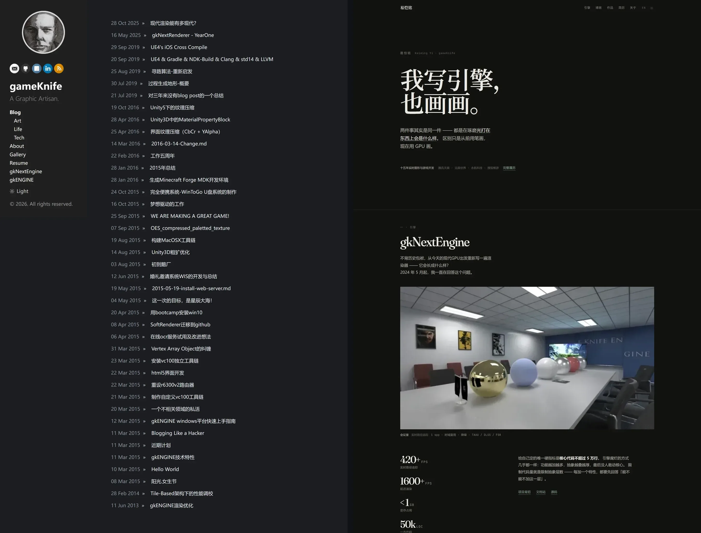

这个博客 2013 年搭在 GitHub Pages 上，Jekyll。十几年里它大部分时间在长草。不是不想翻新，是每次一想到这三件事就放下了：

- 历史外链不能断。44 篇文章的外链和搜索权重都压在旧 URL 上，一换路由规则，十年积累全变 404；
- 中文字体与首屏。全量 CJK 字体一个字重就是几 MB，不配不好看，配了首屏就慢；
- 旧文散在各处。早期文章在博客园，近几年的记录在私人 Markdown 笔记里，图床失效、代码高亮全挂，手动搬迁是巨大的体力活。

上周末我拉上 code agent（Claude Code 和 Antigravity），把它彻底翻成了 Astro 5 + TypeScript。跨度两天，实际坐在电脑前和 agent 交流、发指令的时间，加起来两三个小时。

做完盘点，这次拿到手的是：

- 44 个历史 URL 原样保留，一个字节没动，老外链全部存活；
- 从博客园捞回 25 篇毕设与早期图形学旧文，图片全部转 WebP 本地化；
- 从数年私人笔记里整理出 27 篇技术草稿；
- 构建产物纯静态，零客户端 JS 运行时。

新站就是你现在看到的这个站，全部代码开源在 [github.com/gameknife/gameknife.github.io](https://github.com/gameknife/gameknife.github.io)。下面按实际发生的顺序记这四步，和中间几个值得留下来的判断。

## 第一步：先把底线写成会失败的脚本

旧站 44 篇文章的 URL 格式（`/tech/YYYY/MM/DD/slug/`）是十年外链和搜索权重的落点，一个字节都不能动。

这个约束不能只写在 prompt 里。自然语言的嘱咐，AI 当时会答应，写着写着就会因为某个插件的默认行为把路径吞掉。

所以动手前先做了两件事：把线上 44 条历史路径抓下来存成快照（`scripts/legacy-urls.json`），再写一个 `scripts/verify-urls.mjs`，构建后扫描 `dist/`，少一个页面直接 `process.exit(1)`。接进 CI，每次构建必跑。

约束写成散文，AI 会点头然后照样违反；写成会让构建失败的脚本，它绕不过去。

## 第二步：现代栈，和中文字体的真子集

技术栈选了 Astro 5 加 Content Collections，文章元数据在编译期走 schema 校验，字段写错构建直接报。

中文个人站的两个老问题，这次这样解：

- 正文中文走系统字体栈，零网络请求；
- 标题用 Noto Serif SC，但走真子集：一个脚本在每次构建前扫描 `src/` 里出现过的全部汉字，把 24 MB 的字体裁到约 290 KB。新文章带进新字会自动收进去，不会出豆腐块。

配好 `.claude/launch.json` 之后，agent 可以自己起 `astro dev`、自己开页面确认渲染效果，不需要我在窗口之间来回切换刷新。

## 第三步：把博客园老号整个搬回来

我在博客园有个 2010 年注册的老号，里面是毕设时期自研渲染器的文章。

agent 用无头浏览器加脚本，十几分钟走完全流程：逐篇抓正文和发布日期；批量下载引用图片，转成 WebP 存到本地；把富文本清洗成标准 Markdown，图片改写为相对路径，代码块识别出语言。

整个过程沉淀成一个可以重跑的迁移脚本，一口气捞回 25 篇 2010 到 2015 年的旧文，把建站前那段历史补上了。

## 第四步：从私人笔记提炼成文

2021 到 2025 年我公开写得少，但本地记了数十万字的私人 devlog 和技术笔记。这一步是整场重构里和 agent 协作最顺的一段。

「AI 写的文章千篇一律、满篇废话」，这个担心我也有。但这次的前提不一样：前三步已经把 2010 年以来的存量文章全部收进了仓库，44 篇 Jekyll 时期的，加上刚捞回来的 25 篇博客园旧文。agent 通读一遍之后，对「我是谁」的认知相当具体：偏 C++ 和渲染底层的工程师，叙事从工程现场第一人称切入，用 commit 和数据代替泛谈。

把大段碎片化的 devlog 喂进去，它吐出来的初稿经常让我愣一下：当年随手记的踩坑思路和设计动机，被组织成了结构完整的技术长文，读起来还像我自己写的。我管这个叫嘴替。

当然不是每篇初稿都成。有的语气偏满，有的推论过了头。但协作方式已经变了，更接近给写手校稿：我不从零码字，只挑刺——这段收敛一点，这个对比砍掉，这句修饰删了。它改得很快，我核得也快。

几轮筛选和脱敏之后，27 篇技术草稿全部标成 `draft: true` 入库。它们还没上线：里面的数字全部来自笔记原文，发布前要逐篇核一遍事实，这一步没法交给 agent。

## 几条经验

第一，让 agent 报异常清单，别让它悄悄修复。迁移旧文时我要求脚本输出一份人工复核报告，它真的抓到了东西：有篇旧文缺标题，还有一篇当年少写了扩展名，在旧站上躺了十年从没真正发布过。处理存量数据，异常清单比一份看起来干净的结果有用得多。

第二，拦住 AI 的默认审美。AI 生成配色有个很稳定的倾向：往暖褐陶土色偏。我给配色立了条硬规矩，中性色只留 G−B 分量、守住 R = G，整套颜色就稳定在冷灰上。类似的还有等宽字体：回退栈末尾必须接中文黑体，否则 Windows 会把中文解析成又细又旧的新宋体。

第三，给 agent 写操作手册。踩过的坑、特例路由、构建必跑的命令，固化在仓库根目录的 AGENTS.md 里，比每次开新会话重新教一遍省得多。

第四，人退回决策位。写代码和搬格式已经不是瓶颈，决定什么该公开、核对技术事实，才是剩下真正要人做的事。

## 写到这里

这次翻新，我和 agent 的实际交互只有一两个下午，其余时间是它自己在跑。迁移脚本、字体子集化和 URL 防线都留在仓库里，开源的。

如果你手头也有一个长草多年的旧站，我的建议只有一条：先把不能破的约束写成会让构建失败的脚本，再放 agent 进去。剩下的部分，多半比你预想的顺利。
