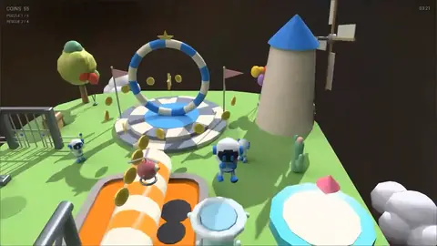
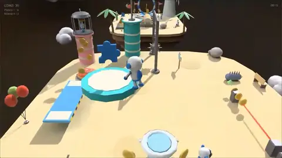
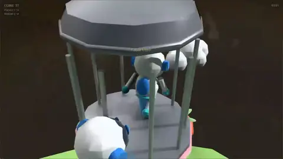

上篇发出去之后，我收到最多的一类反馈是同一个意思：这套东西是不是只对你那张废土地图成立。

这个怀疑是对的。一套零件库、一个游戏，证明不了它可迁移——很可能只是我为 NextDayz 定制了一条管线，顺手起了个通用的名字。

所以我换了个品类重来一遍。从冷战废土换到最不像它的东西：明快玩具色、悬浮岛、圆头机器人的 3D 平台跳跃，参考的是索尼的宇宙机器人。9 月 2 日上午 10:21 的第一个 commit 是一个零件库加一张示例关卡，到第二天 0:27 收尾，一共七个 commit，出来的是 NextAstrobot，能从头玩到结算。

起点是一次纯粹的试用。前一天 fable 5.1 发布，第一版零件库和关卡就是拿它写的，后面的运行时是它和 opus 5 一起做的。哪一段用了哪个模型我都记在 commit message 里，因为这一批 SCAD 是我手边最适合拿来对比模型空间推理能力的活。

先把「一天」这件事说清楚，免得它听起来像我手快。一天能跑完，是因为SCAD的基建已经在了：SCAD 求值器、catalog、放置契约、ScadRig。这次真正新做的只有一层——让零件除了说明自己摆在哪，还说明自己怎么动。

所以这篇番外只讲两件事：kit 为此升级了什么，以及升级完之后，往里加一关还剩多少工作量。



---

## 一、Kit的升级

上篇里最花力气的一张表，是零件的放置契约：所有落地件底面 z = 0，带朝向件 front 朝 −y。它让摆放这一侧可以盲拼——不用打开模型看它朝哪。

但它只能描述静止的东西。

平台跳跃里最重要的那批零件全是会动的：移动平台在轨道上往返，摆锤绕轴摆，滚筒自转还要带着人走，风扇吹出一片风区，喷泉把人托上去。这些东西的行程、周期、相位、风力，放置契约一个字都管不到。

传统做法是再开一份数据：一张机关配置表，按名字和场景里的实例对上号。这条路我走过很多次，代价也很熟——两份数据迟早不同步，而且不同步的时候画面通常是对的，逻辑是错的。

所以这次没有配置表。

`kit_astro.scad` 的文件头多了一段「活动件契约」，和放置契约并列，要点是三条。

可动机关等于一个 `gk_flatten()` 包起来的静态壳，加上若干 `ab_part_*()` 活动件调用；活动件不能折进静态壳，否则运行时就找不到它了。活动件的局部原点就是它的运动基准，父模块用 `translate` / `rotate` 把它摆到绑定姿态，运行时只改这个节点的局部 TRS——于是绑定姿态天然就是 t = 0 的姿态，原版 OpenSCAD 打开看到的，就是动画第一帧。玩法参数一律写成模块的具名参数，哪怕几何根本不用它。

风扇是最干净的例子，`speed`、`power`、`range` 三个参数，几何一个都没碰：

```scad
translate([-37, 1.5, 1.2]) rotate([0, 0, 90]) ab_prop_fan(s = 1.2, speed = 540, power = 6, range = 15);
```

ScadLoader 会把这些具名标量参数序列化成 `"k=v;k=v"` 写进 `Node::metadata`，运行时从那里读回来。于是关卡文件里这一行同时是三样东西：放在哪、长什么样、以及吹多大风。想让峡谷那段更好过一点，就把 `power` 从 6 改成 8，不碰 C++，不碰任何配置文件，git diff 里就是一个数字。

运行时那张表按模块名匹配 21 个机关，18 个有活动件，剩下三个（旋转盘、传送带、弹跳垫）不需要单独的节点，靠脚下位置直接给效果。


## 二、新增一关，只用了3分钟

第三关「极光冰峰」是当天 23:49 那个 commit 加的。它一共动了四个文件：一个 175 行的新 `.scad`，`levels.json` 里 8 行，一个验收脚本，一份文档。C++ 一行没动，引擎一行没动。这是当时1小时前刚出的Gemini Flash 3.8花3分钟做的。

能这样是因为索引、机关、危险、敌人、收集全部按模块名工作。关卡里放一个 `ab_prop_checkpoint(idx = 2)`，它就是检查点；放一对 `idx` 相同的按钮和栅栏门，它们就配上对了。缺了出生点或终点，索引自己会在 `warnings` 里报出来。



## 小结

这篇番外的结论比上下两篇都窄，只回答一个问题：那套东西换个品类还成不成立。

答案是成立，但迁移不是免费的。成本几乎全部花在补那一层契约上——让零件从「说明自己摆在哪」变成「说明自己怎么动」。零件本身反而是最不费劲的部分。

补完之后的收益也很具体：第三关那次提交，是这条路线上第一次出现「加一个完整关卡」等于「一次纯资产提交」。上下两篇里我说关卡设计数据和渲染资产可以是同一份东西，那时候的证据还只是 NextDayz 里的几个刷新点坐标。

如果要从这次里挑一条能带走的经验：发现自己需要为资产再开一份配置表的时候，先想想那些参数能不能直接挂回资产自己身上。挂得回去，两份数据不同步这个问题就从根上没有了；挂不回去，至少你知道自己为什么要付这笔同步成本。



---

**源码 / 链接**

- gkNextEngine：https://github.com/gameknife/gkNextEngine
- NextAstrobot：https://github.com/gameknife/gkNextEngine/tree/dev/src/Application/Game/NextAstrobot
- 上篇：[别让 AI 直接吐 3D 模型，让它写代码](/blog/2026-08-15-scad-kit-terrain/)

